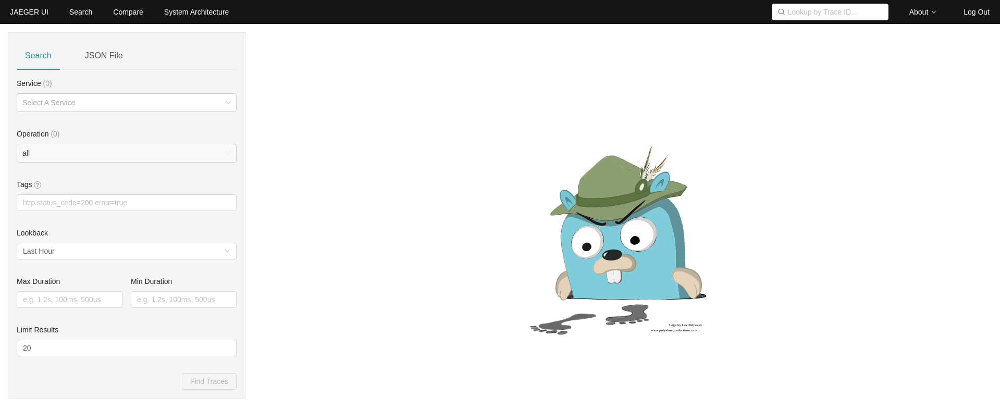
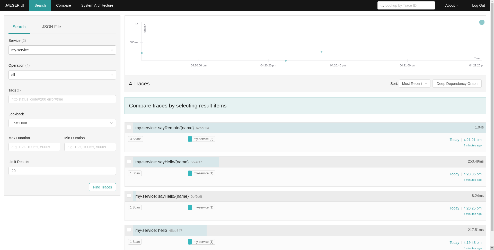

# Using OpenTelemetry and Jaeger with Your Own Services/Application

*By Robert Baumgartner, Red Hat Austria, Janurary 2022 (OpenShift 4.9)*

In this blog I will guide you on

- How to use OpenTelemetry with a Quarkus application.

- How to display your OpenTeleemtry information on Jaeger UI.

I will use the OpenShift operators for my own services.

*OLD* You can use OpenShift Monitoring for your own services in addition to monitoring the cluster. This way, you do not need to use an additional monitoring solution. This helps keep monitoring centralized. Additionally, you can extend the access to the metrics of your services beyond cluster administrators. This enables developers and arbitrary users to access these metrics.

This is based on OpenShift 4.9. See [Distributed tracing release notes](https://docs.openshift.com/container-platform/4.9/distr_tracing/distributed-tracing-release-notes.html).

OpenShift distributed tracing platform Operator is based on Jaeger 1.28.
OpenShift distributed tracing data collection Operator based on OpenTelemetry 0.33. (Technology Preview)

## Enabling Distributed Tracing

A cluster administrator has to enable the Distributed Tracing Platform and Distributed Tracing Data Collection operator once. 

As of OpenShift 4.9, this is be done easyly done by using the OperatorHub on the OpenShift console. See [Installing the Red Hat OpenShift distributed tracing platform Operator](https://docs.openshift.com/container-platform/4.9/distr_tracing/distr_tracing_install/distr-tracing-installing.html#distr-tracing-jaeger-operator-install_install-distributed-tracing).


In this demo we do not install the OpenShift Elasticsearch Operator, because we us only in-memory tracing - no perstistance.

Make sure you are logged in as cluster-admin:


After a short time, you can check that the operator pods were created and running and the CRDs are created:

```shell
$ oc get pod -n openshift-operators|grep jaeger
jaeger-operator-bc65549bd-hch9v                              1/1     Running   0             10d
$ oc get pod -n openshift-operators|grep opentelemetry
opentelemetry-operator-controller-manager-69f7f56598-nsr5h   2/2     Running   0             10d
$ oc get crd jaegers.jaegertracing.io 
NAME                       CREATED AT
jaegers.jaegertracing.io   2021-12-08T15:51:29Z
$ oc get crd opentelemetrycollectors.opentelemetry.io 
NAME                                       CREATED AT
opentelemetrycollectors.opentelemetry.io   2021-12-15T07:57:38Z
```

## Create a New Project

Create a new project (for example jaeger-demo) and give a normal user (such as developer) admin rights onto the project:

```shell
$ oc new-project jaeger-demo
Now using project "jaeger-demo" on server "https://api.yourserver:6443".

You can add applications to this project with the 'new-app' command. For example, try:

    oc new-app rails-postgresql-example

to build a new example application in Ruby. Or use kubectl to deploy a simple Kubernetes application:

    kubectl create deployment hello-node --image=k8s.gcr.io/serve_hostname
$ oc policy add-role-to-user admin developer -n jaeger-demo 
clusterrole.rbac.authorization.k8s.io/admin added: "developer"
```

## Login as the Normal User

```shell
$ oc login -u developer
Authentication required for https://api.yourserver:6443 (openshift)
Username: developer
Password: 
Login successful.

You have one project on this server: "jaeger-demo"

Using project "jaeger-demo".
```

## Create Jaeger

Create a simple Jaeger instance with the name my-jager
```shell
$ cat <<EOF |oc apply -f -
apiVersion: jaegertracing.io/v1
kind: Jaeger
metadata:
  name: my-jaeger
spec: {}
EOF
jaeger.jaegertracing.io/my-jaeger created
```

When the Jaeger instance is up and running you can check the service and route.

```
$ oc get svc
NAME                           TYPE        CLUSTER-IP       EXTERNAL-IP   PORT(S)                                  AGE
my-jaeger-agent                ClusterIP   None             <none>        5775/UDP,5778/TCP,6831/UDP,6832/UDP      73m
my-jaeger-collector            ClusterIP   172.30.127.95    <none>        9411/TCP,14250/TCP,14267/TCP,14268/TCP   73m
my-jaeger-collector-headless   ClusterIP   None             <none>        9411/TCP,14250/TCP,14267/TCP,14268/TCP   73m
my-jaeger-query                ClusterIP   172.30.243.178   <none>        443/TCP,16685/TCP                        73m
$ oc get route my-jaeger -o jsonpath='{.spec.host}'
my-jaeger-jaeger-demo.apps.ocp4.openshift.freeddns.org
```

Open a new browser window and go to the route url and login with your OpenShift login (developer).



## Create OpenTelemetry Collector

Create configmap and an OpenTelemetry Collector instance with the name my-otelcol.

```shell
$ cat <<EOF |oc apply -f -
apiVersion: v1
kind: ConfigMap
metadata:
  annotations:
    service.beta.openshift.io/inject-cabundle: "true"
  name: my-otelcol-cabundle
---
apiVersion: opentelemetry.io/v1alpha1
kind: OpenTelemetryCollector
metadata:
  name: my-otelcol
spec:
  config: |
    receivers:
      otlp:
        protocols:
          grpc:
          http:
    processors:
      batch:

    exporters:
      logging:
        loglevel: info

      jaeger:
        endpoint: my-jaeger-collector-headless.jaeger-demo.svc:14250
        ca_file: "/etc/pki/ca-trust/source/service-ca/service-ca.crt"

    service:
      pipelines:
        traces:
          receivers: [otlp]
          processors: [batch]
          exporters: [logging,jaeger]
  mode: deployment
  resources: {}
  targetAllocator: {}
  volumeMounts:
  - mountPath: /etc/pki/ca-trust/source/service-ca
    name: cabundle-volume
  volumes:
  - configMap:
      name: my-otelcol-cabundle
    name: cabundle-volume
EOF
configmap/my-otelcol-cabundle created
opentelemetrycollector.opentelemetry.io/my-otelcol created
```

*star* In future version of OpenTelemetryCollector (> 0.38) it might be that the configmap and the volumes nd volumesMounts are no longer required.

When the OpenTelemetryCollector instance is up and running you can check log.

```shell
$ oc logs deployment/my-otelcol-collector
2022-01-03T14:57:21.117Z        info    service/collector.go:303        Starting otelcol...     {"Version": "v0.33.0", "NumCPU": 4}
2022-01-03T14:57:21.117Z        info    service/collector.go:242        Loading configuration...
2022-01-03T14:57:21.118Z        info    service/collector.go:258        Applying configuration...
2022-01-03T14:57:21.119Z        info    builder/exporters_builder.go:264        Exporter was built.     {"kind": "exporter", "name": "logging"}
2022-01-03T14:57:21.121Z        info    builder/exporters_builder.go:264        Exporter was built.     {"kind": "exporter", "name": "jaeger"}
2022-01-03T14:57:21.121Z        info    builder/pipelines_builder.go:214        Pipeline was built.     {"pipeline_name": "traces", "pipeline_datatype": "traces"}
2022-01-03T14:57:21.121Z        info    builder/receivers_builder.go:227        Receiver was built.     {"kind": "receiver", "name": "otlp", "datatype": "traces"}
2022-01-03T14:57:21.121Z        info    service/service.go:143  Starting extensions...
2022-01-03T14:57:21.121Z        info    service/service.go:188  Starting exporters...
2022-01-03T14:57:21.121Z        info    builder/exporters_builder.go:93 Exporter is starting... {"kind": "exporter", "name": "logging"}
2022-01-03T14:57:21.121Z        info    builder/exporters_builder.go:98 Exporter started.       {"kind": "exporter", "name": "logging"}
2022-01-03T14:57:21.121Z        info    builder/exporters_builder.go:93 Exporter is starting... {"kind": "exporter", "name": "jaeger"}
2022-01-03T14:57:21.122Z        info    jaegerexporter/exporter.go:186  State of the connection with the Jaeger Collector backend{"kind": "exporter", "name": "jaeger", "state": "CONNECTING"}
2022-01-03T14:57:21.123Z        info    builder/exporters_builder.go:98 Exporter started.       {"kind": "exporter", "name": "jaeger"}
2022-01-03T14:57:21.123Z        info    service/service.go:193  Starting processors...
2022-01-03T14:57:21.123Z        info    builder/pipelines_builder.go:52 Pipeline is starting... {"pipeline_name": "traces", "pipeline_datatype": "traces"}
2022-01-03T14:57:21.123Z        info    builder/pipelines_builder.go:63 Pipeline is started.    {"pipeline_name": "traces", "pipeline_datatype": "traces"}
2022-01-03T14:57:21.123Z        info    service/service.go:198  Starting receivers...
2022-01-03T14:57:21.123Z        info    builder/receivers_builder.go:71 Receiver is starting... {"kind": "receiver", "name": "otlp"}
2022-01-03T14:57:21.123Z        info    otlpreceiver/otlp.go:75 Starting GRPC server on endpoint 0.0.0.0:4317   {"kind": "receiver", "name": "otlp"}
2022-01-03T14:57:21.123Z        info    otlpreceiver/otlp.go:137        Setting up a second GRPC listener on legacy endpoint 0.0.0.0:55680       {"kind": "receiver", "name": "otlp"}
2022-01-03T14:57:21.123Z        info    otlpreceiver/otlp.go:75 Starting GRPC server on endpoint 0.0.0.0:55680  {"kind": "receiver", "name": "otlp"}
2022-01-03T14:57:21.123Z        info    otlpreceiver/otlp.go:93 Starting HTTP server on endpoint 0.0.0.0:4318   {"kind": "receiver", "name": "otlp"}
2022-01-03T14:57:21.123Z        info    otlpreceiver/otlp.go:159        Setting up a second HTTP listener on legacy endpoint 0.0.0.0:55681       {"kind": "receiver", "name": "otlp"}
2022-01-03T14:57:21.123Z        info    otlpreceiver/otlp.go:93 Starting HTTP server on endpoint 0.0.0.0:55681  {"kind": "receiver", "name": "otlp"}
2022-01-03T14:57:21.123Z        info    builder/receivers_builder.go:76 Receiver started.       {"kind": "receiver", "name": "otlp"}
2022-01-03T14:57:21.123Z        info    service/collector.go:206        Setting up own telemetry...
2022-01-03T14:57:21.127Z        info    service/telemetry.go:99 Serving Prometheus metrics      {"address": ":8888", "level": 0, "service.instance.id": "930be080-492b-432b-b5c1-1a6cc0f1b707"}
2022-01-03T14:57:21.127Z        info    service/collector.go:218        Everything is ready. Begin running and processing data.
2022-01-03T14:57:22.123Z        info    jaegerexporter/exporter.go:186  State of the connection with the Jaeger Collector backend{"kind": "exporter", "name": "jaeger", "state": "READY"}
```

Very important is the last line ("State of connection...") which shows that the collector is connected to the Jager instance.
If this is not the case, you have to update the spec.config.exports.jaeger.endpoint value in your OpenTelemetry Collector instance. Should be <jager-collector-headless>.<jaeger-namespace>.svc:14250.

Can be done by:

```shell
$ oc edit opentelemetrycollector my-otelcol
```

## Sample Application

### Deploy a Sample Application

All modern application development frameworks (like Quarkus) supports OpenTelemetry features, [Quarkus - USING OPENTELEMETRY](https://quarkus.io/guides/opentelemetry).

To simplify this document, I am using an existing example. The application is based on an example at [GitHub - rbaumgar/otelcol-demo-app: Quarkus demo app to show OpenTelemetry with Jaeger](https://github.com/rbaumgar/otelcol-demo-app). 

Deploying a sample application monitor-demo-app end expose a route:

```shell
$ cat <<EOF |oc apply -f -
apiVersion: apps/v1
kind: Deployment
metadata:
  labels:
    app: otelcol-demo-app
  name: otelcol-demo-app
spec:
  replicas: 1
  selector:
    matchLabels:
      app: otelcol-demo-app
  template:
    metadata:
      labels:
        app: otelcol-demo-app
    spec:
      containers:
      - image: quay.io/rbaumgar/otelcol-demo-app-jvm
        imagePullPolicy: IfNotPresent
        name: otelcol-demo-app
---
apiVersion: v1
kind: Service
metadata:
  labels:
    app: otelcol-demo-app
  name: otelcol-demo-app
spec:
  ports:
  - port: 8080
    protocol: TCP
    targetPort: 8080
    name: web
  selector:
    app: otelcol-demo-app
  type: ClusterIP
---
apiVersion: route.openshift.io/v1
kind: Route
metadata:
  labels:
    app: otelcol-demo-app
  name: otelcol-demo-app
spec:
  path: /
  to:
    kind: Service
    name: otelcol-demo-app
  port:
    targetPort: web
EOF
deployment.apps/otelcol-demo-app created
service/otelcol-demo-app created
route.route.openshift.io/otelcol-demo-app exposed
```

### Test Sample Application

Check the router url with */hello* and see the hello message with the pod name. Do this multiple times.

```shell
$ export URL=$(oc get route otelcol-demo-app -o jsonpath='{.spec.host}')
$ curl $URL/hello
hello 
$ curl $URL/sayHello/demo1
hello: demo1
$ curl $URL/sayRemote/demo2
hello: demo2 from http://otelcol-demo-app-jaeger-demo.apps.ocp4.openshift.freeddns.org/
...
```

Go to Jager URL.
Reload by pressing F5.
Under Service select my-service. 
Find Traces...



*star* The service name is specified in the application.properties (quarkus.application.name) of the demo app.
*star* The url of the collector is specified in the application.properties (quarkus.opentelemetry.tracer.exporter.otlp.endpoint=http://my-otelcol-collector:4317).

Open one trace entry and expand it to get all the details.


Done!

If you want more details on how the OpenTracing is done in Quarkus go to the Github example at [GitHub - rbaumgar/otelcol-demo-app: Quarkus demo app to show OpenTelemetry with Jaeger](https://github.com/rbaumgar/otelcol-demo-app). 

## Remove this Demo

```shell
$ oc delete deployment,svc,route otelcol-demo-app
$ oc delete opentelemetrycollector my-otelcol
$ oc delete jaeger my-jaeger
$ oc delete cm my-otelcol-cabundle
$ oc delete project jaeger-demo
```

This document: 

**[otelcol-demo-app/OpenTelemetry.md at master · rbaumgar/otelcol-demo-app · GitHub](https://github.com/rbaumgar/otelcol-demo-app/blob/master/OpenTelemetry.md)**