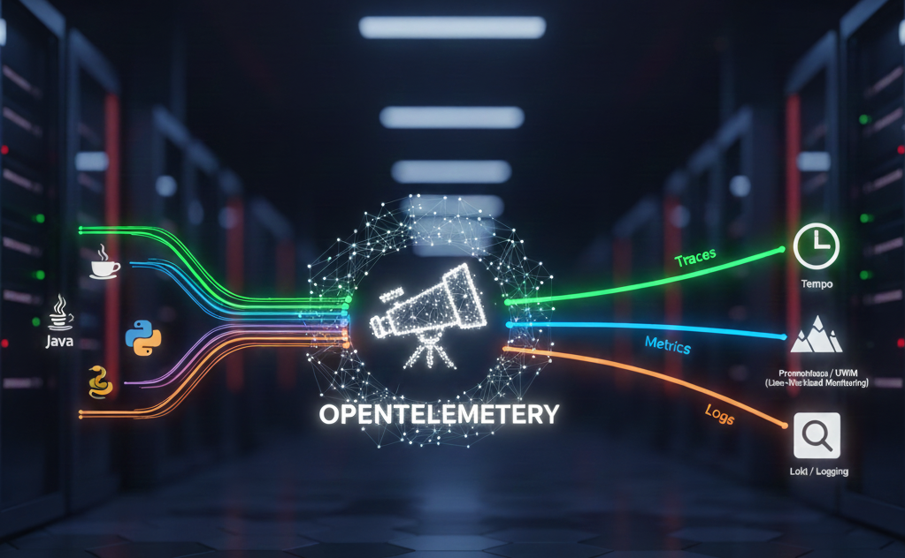

# How to use Auto Instrumentation with OpenTelemetry for Traces and Metrics

Implementing observability in a cloud-native environment can feel like assembling a complex puzzle. On Red Hat OpenShift, **OpenTelemetry (OTel)** is the gold standard for collecting traces, metrics, and logs.

This guide will walk you through installing the **Red Hat build of OpenTelemetry** using the Operator—the most efficient way to manage OTel on OpenShift.


---

## Why Use the Operator?

The OpenTelemetry Operator isn't just an installer; it's a management engine. It handles:

* **Lifecycle Management:** Automates updates and configuration of the Collector.
* **Auto-Instrumentation:** Automatically injects OTel libraries into your Go, Java, Node.js, Python, .NET, and the Apache HTTP Server (httpd) applications without manual code changes.
* **Sidecar Injection:** Transparently adds Collector sidecars to your pods.

---

## Step 1: Install the OpenTelemetry Operator

The easiest way to get started is via the OpenShift Web Console.

1. Log in to your **OpenShift Web Console** with administrator privileges.
2. Navigate to **Operators > OperatorHub**.
3. Search for **"Red Hat build of OpenTelemetry"**.
4. Click **Install**.
5. On the installation page:
* **Update Channel:** Select `stable`.
* **Installation Mode:** Choose `All namespaces on the cluster`.
* **Approval Strategy:** `Automatic`.
6. Click **Install** and wait for the status to show "Succeeded."

> **Tip:** You also need the **cert-manager** Operator installed, as the OpenTelemetry Operator uses it to manage admission webhooks.

---

## Step 2: Create a Collector Instance

Once the Operator is running, you need to deploy an **OpenTelemetryCollector** custom resource (CR). This defines how your data is received and where it is sent.

1. Create a new project: `oc new-project otel-demo`.
2. Go to **Operators > Installed Operators > Red Hat build of OpenTelemetry**.
3. Select the **OpenTelemetry Collector** tab and click **Create OpenTelemetryCollector**.
4. Switch to the **YAML view** and use this basic "Deployment" mode configuration:

```yaml
apiVersion: opentelemetry.io/v1beta1
kind: OpenTelemetryCollector
metadata:
  name: otel
  namespace: otel-demo
spec:
  mode: deployment
  config:
    receivers:
      otlp:
        protocols:
          grpc: {}
          http: {}
    processors:
      batch: {}
    exporters:
      debug:
        verbosity: detailed
    service:
      pipelines:
        traces:
          receivers: [otlp]
          processors: [batch]
          exporters: [debug]
```

This configuration sets up a Collector that receives data via OTLP and logs it to the console (standard output) for debugging.

---

## Step 3: Auto-Instrumentation (The "Magic" Part)

One of the best features of the OpenShift implementation is **Instrumentation CR**. This allows you to instrument your apps without touching their Dockerfiles.

1. In the same namespace, create an **Instrumentation** resource:

```yaml
apiVersion: opentelemetry.io/v1alpha1
kind: Instrumentation
metadata:
  name: my-instrumentation
  namespace: otel-demo
spec:
  exporter:
    env:
      - name: OTEL_SEMCONV_STABILITY_OPT_IN
        value: http  
    endpoint: http://otel-collector:4317
  propagators:
    - tracecontext
    - baggage
  sampler:
    type: parentbased_traceidratio
    argument: "1"
  java:
    resources:
      limits: {}
      requests: {}             
  nodejs:
    env:
      - name: OTEL_EXPORTER_OTLP_ENDPOINT
        value: 'http://otel-collector:4318'
      - name: OTEL_METRICS_EXPORTER
        value: otlp
  python:
    env:
      # Python auto-instrumentation uses http/proto by default
      - name: OTEL_EXPORTER_OTLP_ENDPOINT
        value: http://otel-collector:4318
```

The environment **OTEL_SEMCONV_STABILITY_OPT_IN** is used that all the export are using the same semantic, see [HTTP semantic conventions declared stable](https://opentelemetry.io/blog/2023/http-conventions-declared-stable/).

For the version 2 of the Java auto instrumentation library use:
```yaml 
  java:
    env:
      - name: OTEL_EXPORTER_OTLP_ENDPOINT
        value: 'http://otel-collector:4318'
    image: 'ghcr.io/open-telemetry/opentelemetry-operator/autoinstrumentation-java:2.23.0'
```    

2. **Activate it:** To instrument a Java application, simply add an annotation to your Deployment’s pod template:

```yaml
spec:
  template:
    metadata:
      annotations:
        instrumentation.opentelemetry.io/inject-java: "true"
```

The next time your pod restarts, the Operator will inject the Java agent, and your traces will start flowing to the collector!

If you do not have a sample Java application, you can use the OpenShift Java sample.

```bash
oc new-app --name java-demo \
  -i java:openjdk-17-ubi8 \
  --context-dir undertow-servlet \
  https://github.com/jboss-openshift/openshift-quickstarts
# oc expose service/java-demo
oc create route edge --service java-demo --insecure-policy Redirect
oc patch deployment java-demo --type='json' -p='[{"op": "add", "path": "/spec/template/metadata/annotations", "value": {"instrumentation.opentelemetry.io/inject-java": "true"} }]'
```

---

## Part 4: Deploy and Instrument a Python App

Now we will deploy a simple Python web server. We will not change the Python code. We will simply add an **annotation** to the deployment YAML.

1.  Create a file named `my-python-app.yaml`. Notice the `annotations` section:

```yaml
apiVersion: apps/v1
kind: Deployment
metadata:
  name: python-app
  namespace: otel-demo
spec:
  replicas: 1
  selector:
    matchLabels:
      app: python-app
  template:
    metadata:
      labels:
        app: python-app
      annotations:
        # THIS IS THE KEY LINE
        instrumentation.opentelemetry.io/inject-python: "true"
    spec:
      containers:
        - name: python-app
          image: ubi9/python-312-minimal
          command: ["/bin/sh", "-c"]
          args:
            - |
              pip install flask
              cat <<EOF > main.py
              from flask import Flask
              app = Flask(__name__)
              @app.route("/")
              def hello():
                  return "Hello OpenTelemetry from Python"
              if __name__ == "__main__":
                  app.run(host="0.0.0.0", port=5000)
              EOF
              python main.py

          ports:
            - containerPort: 5000
```

2.  **Deploy the application:**
```bash
oc apply -f my-python-app.yaml
```

3.  **Wait for the Pod:**
Watch the pod spin up. You might notice the Operator "mutating" the pod.
```bash
oc get pods -n otel-demo
```
If you describe the pod (`oc describe pod <pod-name>`), you will see that the OpenTelemetry Operator injected an `initContainer` to copy the agent files and set environment variables automatically.

Now let's generate some traffic and see if "Auto-Instrumentation" actually worked.

4.  **Forward a port to the application:**
```bash
oc port-forward deployment/python-app 8080:5000 -n otel-demo
```

5.  **Generate Traffic:**
Open a new terminal or browser and hit the endpoint:
```bash
curl http://localhost:8080
```

Do this 2 or 3 times.

---

## Part 5: Deploy and Instrument a NodeJS App

Now we will deploy a simple NodeJs web app with a PostgreSQL database. We will not change the NodeJS code. We will simply add an **annotation** to the deployment YAML.

1.  **Deploy the application:** With conversation to Deployment
```bash
oc process openshift//nodejs-postgresql-example | \
   jq '.items = [(.items[] | select(.kind == "DeploymentConfig") | .apiVersion="apps/v1" | .kind = "Deployment" | .spec.selector.matchLabels=.spec.template.metadata.labels | .spec.template.spec.containers[0].image=(.spec.triggers[] | select(.type=="ImageChange").imageChangeParams.from.name) | del(.spec.triggers) | del(.spec.strategy) | del(.spec.template.name)), (.items[] | select(.kind != "DeploymentConfig"))]' | \
   oc apply -f -
oc annotate deploy/nodejs-postgresql-example image.openshift.io/triggers='[{"from":{"kind":"ImageStreamTag","name":"nodejs-postgresql-example:latest"},"fieldPath":"spec.template.spec.containers[?(@.name==\"nodejs-postgresql-example\")].image"}]'
oc annotate deploy/postgresql image.openshift.io/triggers='[{"from":{"kind":"ImageStreamTag","name":"postgresql:12-el8","namespace":"openshift"},"fieldPath":"spec.template.spec.containers[?(@.name==\"postgresql\")].image"}]'    
oc set probe deploy/nodejs-postgresql-example --readiness --get-url http://:8080/ready
oc set probe deploy/nodejs-postgresql-example --liveness --get-url http://:8080/live
```
2.  ** Patch the deployment config**
```bash
oc patch deployment nodejs-postgresql-example --type='json' -p='[{"op": "add", "path": "/spec/template/metadata/annotations", "value": {"instrumentation.opentelemetry.io/inject-nodejs": "true"} }]'
```

3.  **Wait for the Pod:**
Watch the pod spin up. You might notice the Operator "mutating" the pod.
```bash
oc get pod -l name=nodejs-postgresql-example
```
If you describe the pod (`oc describe pod <pod-name>`), you will see that the OpenTelemetry Operator injected an `initContainer` to copy the agent files and set environment variables automatically.

Now let's generate some traffic and see if "Auto-Instrumentation" actually worked.

4.  **Get the URL of the application:**
```bash
oc get route -l app=nodejs-postgresql-example
```

5.  **Generate Traffic:**
Open in a browser the endpoint

Do this 2 or 3 times.

---

## (optional) Part 6: Deploy and Instrument a Apache Httpd App

instrumentation.opentelemetry.io/inject-apache-httpd: "true"
instrumentation.opentelemetry.io/configPath: "/etc/httpd/conf" does not work!

Error:
httpd: Syntax error on line 361 of /etc/httpd/conf/httpd.conf: Syntax error on line 8 of /etc/httpd/conf/opentemetry_agent.conf: Cannot load /opt/opentelemetry-webserver/agent/sdk_lib/lib/libopentelemetry_exporter_otlp_grpc.so into server: libnsl.so.1: cannot open shared object file: No such file or directory
---

## (optional) Part 7: Deploy and Instrument a Go App

Now we will deploy a simple Go web server. We will not change the Go code. We will simply add an **annotation** to the deployment YAML.

instrumentation.opentelemetry.io/inject-go: "true"
instrumentation.opentelemetry.io/otel-go-auto-target-exe: "/opt/app-root/src/main" 

apiVersion: security.openshift.io/v1
kind: SecurityContextConstraints
metadata:
  name: otel-go-instrumentation-scc
allowHostDirVolumePlugin: true
allowPrivilegeEscalation: true
allowPrivilegedContainer: true
allowedCapabilities:
- "SYS_PTRACE"
fsGroup:
  type: RunAsAny
runAsUser:
  type: RunAsAny
seLinuxContext:
  type: RunAsAny
seccompProfiles:
- '*'
supplementalGroups:
  type: RunAsAny

oc create sa golang

oc adm policy add-scc-to-user otel-go-instrumentation-scc -z golang

Error: wrong symvers!

---

## Step 8: Verify the Flow

To ensure everything is working:

1. Check the Collector logs:
```bash
oc logs deployment/otel-collector -n otel-demo
```

2. If you see traces or metrics being printed in the logs, your pipeline is active.

---

## Summary Table: Deployment Modes

| Mode | Best For | Pros |
| --- | --- | --- |
| **Deployment** | Testing / Gateway | Simple to manage, centralized. |
| **DaemonSet** | Node-level metrics | Collects logs/metrics from every node. |
| **Sidecar** | High security/Low latency | Injects the collector directly into the app pod. |

---

### Troubleshooting Tips

If you just want to test if your Collector is working *right now* without a whole microservice architecture, use a simple `curl` loop against the collector's OTLP endpoint:

```bash
# Send a test span manually via OTLP/HTTP
curl -X POST http://otel-collector:4318/v1/traces \
-H "Content-Type: application/json" \
-d '{"resourceSpans": [{"resource": {"attributes": [{"key": "service.name", "value": {"stringValue": "test-app"}}]}, "scopeSpans": [{"spans": [{"traceId": "4bf92f3577b34da6a3ce929d0e0e4736", "spanId": "00f067aa0ba902b7", "name": "test-span", "kind": 1, "startTimeUnixNano": "1625083652123456789", "endTimeUnixNano": "1625083652223456789"}]}]}]}'
```

---

## What's Next?

Integrating OpenTelemetry with **Tempo** is the final piece of the observability puzzle on OpenShift. While the `debug` exporter is great for testing, a production setup typically sends traces to a **TempoStack** (the managed Jaeger-replacement for OpenShift).

Here is how to bridge the two.

---

## Prerequisites

Before starting, ensure you have:

1. The **Tempo Operator** installed.
2. A **TempoStack** instance already running in your cluster.
3. An object storage secret (like S3 or MinIO) configured for Tempo.

---

## Step 1: Identify your Tempo Endpoint

TempoStack exposes an OTLP (gRPC) endpoint that the Collector needs to target. Usually, the internal service URL follows this pattern:
`http://<tempostack-name>-distributor.<namespace>.svc:4317`

> **Note:** If you have enabled mTLS or OpenShift's internal authentication (RBAC), you may need to provide a service account token or certificates in the collector config.

---

## Step 2: Update the Collector Configuration

You need to modify your `OpenTelemetryCollector` YAML to replace the `debug` exporter with an `otlp` exporter pointing to Tempo.

1. Navigate to **Operators > Installed Operators > Red Hat build of OpenTelemetry**.
2. Select your **otel-collector** instance and click **Edit OpenTelemetryCollector**.
3. Update the YAML to look like this:

```yaml
apiVersion: opentelemetry.io/v1beta1
kind: OpenTelemetryCollector
metadata:
  name: otel
  namespace: otel-demo
spec:
  mode: deployment
  config:
      extensions:
        # create extension
        bearertokenauth:
          filename: "/var/run/secrets/kubernetes.io/serviceaccount/token"  
    receivers:
      otlp:
        protocols:
          grpc: {}
          http: {}
    processors:
      batch:
        # Batching is critical for performance when sending to Tempo
        send_batch_size: 1000
        timeout: 10s
    exporters:
      otlp/tempo:
        # Replace with your actual TempoStack service name and namespace
        endpoint: "tempo-simplest-gateway.tempo-demo.svc:8090"
        tls:
          insecure: false
          ca_file: "/var/run/secrets/kubernetes.io/serviceaccount/service-ca.crt"
        auth:
          authenticator: bearertokenauth
        headers:
          X-Scope-OrgID: "dev"                               
    service:
      # enable extension
      extensions: [bearertokenauth]    
      pipelines:
        traces:
          receivers: [otlp]
          processors: [batch]
          exporters: [otlp/tempo] # Now sending to Tempo
```

---

## Step 3: Grant Permissions (If using RBAC)

If your TempoStack is secured (which is the default in many OpenShift environments), your Collector's ServiceAccount needs permission to write to Tempo.

You can create a **ClusterRoleBinding** to allow the `otel-collector` service account to act as a "tempostack-traces-write":

```bash
oc adm policy add-cluster-role-to-user tempostack-traces-write -z otel-collector
```

---

## Step 4: Visualize in the OpenShift Console

Once the data is flowing, you can view your traces directly within the OpenShift UI:

1. In the **Administrator** perspective, go to **Observe > Traces**.
2. Select your **TempoStack** as the data source.
3. Search for your service name (e.g., your Java or Python app) to see the distributed spans.

---

### Troubleshooting Tips

* **Check Collector Logs:** Run `oc logs deployment/otel-collector` to see if the `otlp/tempo` exporter is throwing "Connection Refused" errors.
* **Batch Processor:** Always use the `batch` processor when sending to Tempo; it prevents the distributor from being overwhelmed by many small requests.

To send application metrics from OpenTelemetry to OpenShift’s **User-Workload Monitoring**, you have two primary methods: the "Scrape" method (OpenShift pulls data from the Collector) or the "Push" method (the Collector sends data to OpenShift).

On OpenShift, the **Scrape method** is the standard, most reliable approach as it leverages the built-in Prometheus Operator.

---

## Step 1: Enable User-Workload Monitoring

First, ensure your cluster is configured to monitor user-defined projects.

1. Check if the configuration exists:
```bash
oc get configmap cluster-monitoring-config -n openshift-monitoring
```

2. If it doesn't, or if `enableUserWorkload` is not `true`, create/edit the ConfigMap:
```yaml
apiVersion: v1
kind: ConfigMap
metadata:
  name: cluster-monitoring-config
  namespace: openshift-monitoring
data:
  config.yaml: |
    enableUserWorkload: true
```

---

## Step 2: Configure the Collector to Expose Metrics

You must configure the Collector to act as a Prometheus target. This involves adding a `prometheus` exporter and enabling the Operator to create a `ServiceMonitor`.

Update your `OpenTelemetryCollector` CR:

```yaml
apiVersion: opentelemetry.io/v1beta1
kind: OpenTelemetryCollector
metadata:
  name: otel
  namespace: otel-demo
spec:
  observability:
    metrics:
      # This tells the Operator to automatically create a ServiceMonitor
      enableMetrics: true
  config:
    receivers:
      otlp:
        protocols:
          grpc: {}
          http: {}          
    exporters:
      prometheus:
        endpoint: "0.0.0.0:8889"
        # Optional: Add resource attributes as Prometheus labels
        resource_to_telemetry_conversion:
          enabled: true 
    service:
      pipelines:
        metrics:
          receivers: [otlp]
          exporters: [prometheus]
```

---

## Step 3: Verify the ServiceMonitor

The OpenTelemetry Operator will automatically detect `enableMetrics: true` and create a **ServiceMonitor** in your namespace. This resource tells OpenShift's Prometheus instance exactly where to find your OTel metrics.

Verify it was created:

```bash
oc get servicemonitor -n otel-demo
```

---

## Step 4: View Metrics in the Console

Once configured, your application metrics (sent via OTLP to the collector) are converted to Prometheus format and scraped by the platform.

1. Switch to the **Developer** perspective in the OpenShift Web Console.
2. Go to **Observe > Metrics**.
3. In the "Query" box, try searching for a metric emitted by your app or a standard OTel metric like `otelcol_process_uptime_seconds_total`.
4. **Note:** It may take 1-2 minutes for the first data points to appear after the ServiceMonitor is created.

---

## Summary of the Data Flow

| Component | Role |
| --- | --- |
| **App SDK** | Pushes OTLP metrics to the Collector. |
| **Collector Receiver** | Accepts the OTLP data. |
| **Collector Exporter** | Hosts a `/metrics` endpoint on port `8889`. |
| **ServiceMonitor** | Tells OpenShift Prometheus to scrape that port. |
| **User Prometheus** | Stores the data and makes it available for alerts/dashboards. |

---

### Pro-Tip: The "Push" Alternative

If you prefer to **push** metrics directly to the OpenShift monitoring stack (Remote Write) rather than having Prometheus scrape the collector, you would use the `prometheusremotewrite` exporter. However, this requires handling authentication via a ServiceAccount token, making the **Scrape** method (Step 2 above) the much simpler "OpenShift-native" choice.

## What's next?

To visualize these metrics effectively, you can use the built-in **OpenShift Monitoring UI**.

---

## The OpenShift Native Way 

Since you enabled **User-Workload Monitoring**, OpenShift already provides a place to query and view these metrics without installing extra tools.

1. Switch to the **Developer Perspective** in the web console.
2. Go to **Observe > Metrics**.
3. In the **Expression** field, enter this PromQL query to see your application's request rate:
```promql
sum(rate(http_server_request_duration_seconds_count[5m])) by (service_name)
```

To calculate the 90th percentile of request durations over the last 2m: 
```promql
histogram_quantile(0.90, sum by (k8s_container_name,http_route,le) (rate(http_server_request_duration_seconds_bucket[2m])))
```


4. To see the Collector's own health (how much data it's processing), try:
```promql
sum(rate(otelcol_receiver_accepted_metric_points_total[5m])) by (receiver)
```

