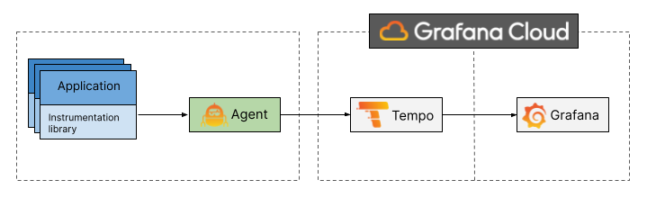
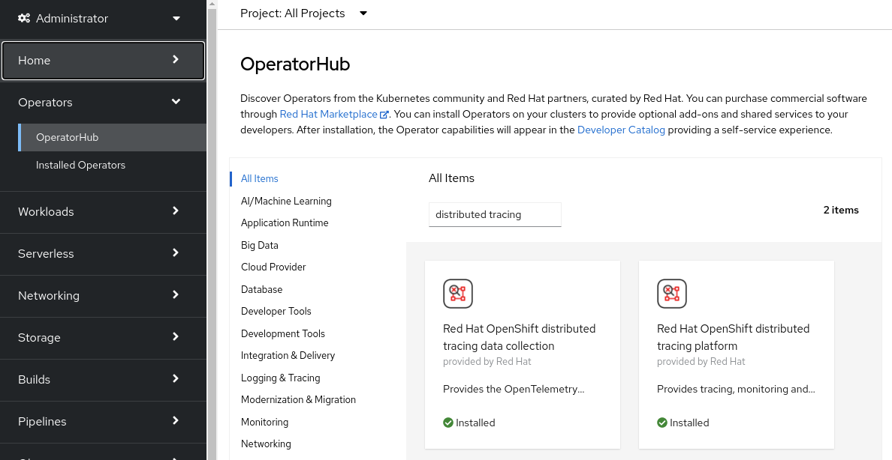
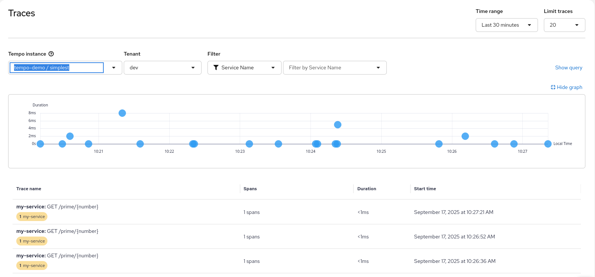
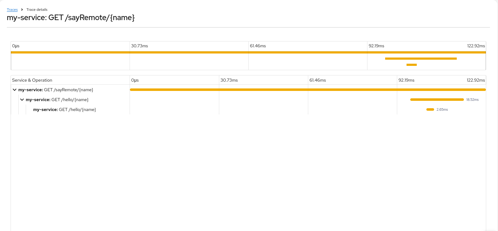

# Using OpenTelemetry and Distributed Traing with Your Own Services/Application


*By Robert Baumgartner, Red Hat Austria, September 2025 (OpenShift 4.19, OpenShift Distributed Tracing 3.6.1, Red Hat build of OpenTelemetry 3.6.1)*

In this blog, I will guide you on

- How to use OpenTelemetry with a Quarkus application.

- How to forward your OpenTelememtry information to Tempo and display it in Grafana UI.

I will use distributed tracing to instrument my services to gather insights into my service architecture. I am using distributed tracing for monitoring, network profiling, and troubleshooting the interaction between components in modern, cloud-native, microservices-based applications.

Using distributed tracing lets you perform the following functions:

- Monitor distributed transactions
- Optimize performance and latency
- Perform root cause analysis

This document is based on OpenShift 4.19. 
See [Red Hat build of OpenTelemetry](https://docs.redhat.com/en/documentation/openshift_container_platform/4.19/html/red_hat_build_of_opentelemetry/)
See [Distributed tracing release notes](https://docs.redhat.com/en/documentation/openshift_container_platform/4.19/html/distributed_tracing/).

Red Hat build of OpenTelemetry 3.8 is provided through the Red Hat build of OpenTelemetry Operator 0.140.0 and based on the open source OpenTelemetry release 0.140.0.

Distributed Tracing Platform 3.8 is provided through the Tempo Operator 0.19.0 and based on the open source Grafana Tempo 2.9.0.

## OpenTelemetry and Grafana Tempo

**OpenTelemetry** is a collection of tools, APIs, and SDKs. Use it to instrument, generate, collect, and export telemetry data (metrics, logs, and traces) to help you analyze your software’s performance and behavior.

**Grafana Tempo** is an open source, easy-to-use, and high-scale distributed tracing backend. Tempo is cost-efficient, requiring only object storage to operate, and is deeply integrated with Grafana, Prometheus, and Loki. (https://github.com/grafana/tempo)

In the following diagram, I will show you how the flow will be between your application, OpenTelemetry, and Grafana Tempo.



To make the demo simpler I am using **Grafana Cloud**. Grafana Cloud is an open and composable observability platform that brings together metrics, logs and traces with Grafana visualizations. Built for cloud native environments and powered by the best open source observability software – including Prometheus, Grafana Mimir, Grafana Loki, and Grafana Tempo – Grafana Cloud lets you focus on enabling observability, without the overhead of building, installing, maintaining, and scaling your observability stack.

More details can be found

- [OpenTelemetry Reference Architecture](https://opentelemetry.io/docs/)
- [Grafana Cloud](https://grafana.com/products/cloud/)

## Enabling Red Hat build of OpenTelemetry

A cluster administrator has to enable the Red Hat build of OpenTelemetry operator once. 

As of OpenShift 4.19, this is done easily using the OperatorHub on the OpenShift console. See [Installing the Red Hat build of OpenTelemetry from the web console](https://docs.redhat.com/en/documentation/openshift_container_platform/4.19/html-single/red_hat_build_of_opentelemetry/index#installing-otel-by-using-the-web-console_install-otel).



Make sure you are logged in as cluster-admin.

After a short time, you can check that the operator pod is created and running and the CRD is created:

```shell
$ oc get pod -n openshift-opentelemetry-operator 
NAME                                                         READY   STATUS    RESTARTS   AGE
opentelemetry-operator-controller-manager-79589bf999-w79nm   2/2     Running   0          14m
$ oc get crd opentelemetrycollectors.opentelemetry.io
NAME                                       CREATED AT
opentelemetrycollectors.opentelemetry.io   2025-09-16T08:18:52Z
```

## Enabling Distributed Tracing

A cluster administrator has to enable the Distributed Tracing operator once. 

As of OpenShift 4.19, this is done easily using the OperatorHub on the OpenShift console. See [Installing the Tempo Operator](https://docs.redhat.com/en/documentation/openshift_container_platform/4.19/html-single/distributed_tracing/index#installing-the-tempo-operator_distr-tracing-tempo-installing).


Make sure you are logged in as cluster-admin.

After a short time, you can check that the operator pod is created and running and the CRD is created:

```shell
$ oc get pod -n openshift-tempo-operator 
NAME                                         READY   STATUS    RESTARTS   AGE
tempo-operator-controller-6c9c8d944c-wvhjz   1/1     Running   0          25m
```

create a secret for the object store.
see https://docs.redhat.com/en/documentation/openshift_container_platform/4.19/html-single/distributed_tracing/index#distr-tracing-tempo-object-storage-setup_distr-tracing-tempo-installing

name: tempostack-dev-minio # example
bucket: <minio_bucket_name> # MinIO documentation
endpoint: <minio_bucket_endpoint>
access_key_id: <minio_access_key_id>


## Create a New Project

Create a new project (for example tempo-demo) and give a normal user (such as a developer) admin rights to the project:
 
```shell
$ oc new-project tempo-demo
Now using project "tempo-demo" on server "https://api.yourserver:6443".

You can add applications to this project with the 'new-app' command. For example, try:

    oc new-app rails-postgresql-example

to build a new example application in Ruby. Or use kubectl to deploy a simple Kubernetes application:

    kubectl create deployment hello-node --image=k8s.gcr.io/serve_hostname
$ oc policy add-role-to-user admin developer -n tempo-demo 
clusterrole.rbac.authorization.k8s.io/admin added: "developer"
```

## Login as the Normal User

```shell
$ oc login -u developer
Authentication required for https://api.yourserver:6443 (openshift)
Username: developer
Password: 
Login successful.

You have one project on this server: "tempo-demo"

Using project "tempo-demo".
```

## Create Minio secret

```shell
$ export TEMPO_DEMO_SECRET=$(tr -dc 'A-Za-z0-9!?%=' < /dev/urandom | head -c 12)
$ cat <<EOF |oc apply -f -
apiVersion: v1
kind: Secret
metadata:
  name: minio-test
stringData:
  endpoint: http://minio.minio.svc:9000
  bucket: tempo-demo
  access_key_id: tempo-demo
  access_key_secret: ${TEMPO_DEMO_SECRET}
type: Opaque
EOF
```

## Change to Minio project

```shell
$ oc project minio
```

## Create access to minio bucket

```shell
$ cat > tempo-demo-access-policy.json <<EOF
{
    "Version": "2012-10-17",
    "Statement": [
        {
             "Action": ["s3:*"],
             "Effect": "Allow",
             "Resource": ["arn:aws:s3:::tempo-demo",
                          "arn:aws:s3:::tempo-demo/*"]
        }
    ]
}
EOF
```

# copy policy file to pod
$ cat tempo-demo-access-policy.json | \
  oc -n minio exec deployments/minio-server -i -- sh -c "cat /dev/stdin > /tmp/tempo-demo-access-policy.json"
$ rm tempo-demo-access-policy.json
$ oc rsh -n minio deployments/minio-server

# create an alias for the connection
mc alias set myminio http://localhost:9000 minio $MINIO_ADMIN_PWD
# create new policy
mc admin policy create myminio tempo-demo-access-policy /tmp/tempo-demo-access-policy.json
# create tempo-demo
mc mb myminio/tempo-demo
# create user
mc admin user add myminio tempo-demo $TEMPO_DEMO_SECRET
# attach openshift-logging-acccess-policy to user openshift-logging
mc admin policy attach myminio tempo-demo-access-policy --user tempo-demo
exit


## create a Networkpolicy

If NetworkPolicies are used make sure that the newly created project can access Minio.

```shell
$ cat <<EOF |oc apply -f -
apiVersion: networking.k8s.io/v1
kind: NetworkPolicy
metadata:
  name: allow-from-tempo-demo
  namespace: minio
spec:
  podSelector:
    matchLabels:
      app.kubernetes.io/name: minio
  ingress:
  - from:
    - namespaceSelector:
        matchLabels:
          kubernetes.io/metadata.name: tempo-demo
      ports:
        - port: 9000
EOF
networkpolicy.networking.k8s.io/allow-from-tempo-demo created
```

## Go back to the project

```shell
$ oc project tempo-demo
```

## Create TempoStack

```shell
$ cat <<EOF |oc apply -f -
apiVersion: tempo.grafana.com/v1alpha1
kind: TempoStack
metadata:
  name: simplest
spec:
  storage:
    secret:
      name: minio-test
      type: s3
  storageSize: 1Gi
  resources:
    total:
      limits:
        memory: 2Gi
        cpu: 2000m
  tenants:
    mode: openshift
    authentication:
      - tenantName: dev
        tenantId: "1610b0c3-c509-4592-a256-a1871353dbfa"
      - tenantName: prod
        tenantId: "1610b0c3-c509-4592-a256-a1871353dbfb"
  template:
    gateway:
      enabled: true
    queryFrontend:
      jaegerQuery:
        enabled: true
        monitorTab:
          enabled: true 
          prometheusEndpoint: https://thanos-querier.openshift-monitoring.svc.cluster.local:9091
EOF
```

!!! resources can be removed if you don't want to set limits.

## Check running pods

```shell
$ oc get pod
NAME                                             READY   STATUS    RESTARTS   AGE
tempo-simplest-compactor-cbdc5b8f4-mk6xb         1/1     Running   0          49m
tempo-simplest-distributor-6dfb99697f-ltth5      1/1     Running   0          77m
tempo-simplest-gateway-6fbbb44cd8-b7vf4          2/2     Running   0          77m
tempo-simplest-ingester-0                        1/1     Running   0          49m
tempo-simplest-querier-85746fdf85-nv56z          1/1     Running   0          49m
tempo-simplest-query-frontend-655d6785bf-fbpdn   3/3     Running   0          49m

$ oc get tempostacks -o json simplest | jq .status.components
{
  "compactor": {
    "Running": [
      "tempo-simplest-compactor-cbdc5b8f4-mk6xb"
    ]
  },
  "distributor": {
    "Running": [
      "tempo-simplest-distributor-6dfb99697f-ltth5"
    ]
  },
  "gateway": {
    "Running": [
      "tempo-simplest-gateway-6fbbb44cd8-b7vf4"
    ]
  },
  "ingester": {
    "Running": [
      "tempo-simplest-ingester-0"
    ]
  },
  "querier": {
    "Running": [
      "tempo-simplest-querier-85746fdf85-nv56z"
    ]
  },
  "queryFrontend": {
    "Running": [
      "tempo-simplest-query-frontend-655d6785bf-fbpdn"
    ]
  }
}
```

## create a Networkpolicy for Distributed tracing

If NetworkPolicies are used make sure that the newly created project can be accessed by the Distributed Tracing UIPlugin.

```shell
$ cat <<EOF |oc apply -f -
apiVersion: networking.k8s.io/v1
kind: NetworkPolicy
metadata:
  name: allow-from-distributed-tracing
  namespace: tempo-demo
spec:
  podSelector:
    matchLabels:
      app.kubernetes.io/component: gateway
  ingress:
  - from:
    - namespaceSelector:
        matchLabels:
          kubernetes.io/metadata.name: openshift-cluster-observability-operator
      ports:
        - port: 8080
EOF
networkpolicy.networking.k8s.io/allow-from-distributed-tracing created
```

## Create SA for otel-collector

```shell
$ oc apply -f - << EOF
apiVersion: v1
kind: ServiceAccount
metadata:
  name: otel-collector
EOF
```

## Create cluster role for tenant

The next steps has be made a cluster admin.

```shell
$ oc apply -f - << EOF
apiVersion: rbac.authorization.k8s.io/v1
kind: ClusterRole
metadata:
  name: tempostack-traces-reader
rules:
  - apiGroups:
      - 'tempo.grafana.com'
    resources:
      - dev
      - prod
    resourceNames:
      - traces
    verbs:
      - 'get'
---
apiVersion: rbac.authorization.k8s.io/v1
kind: ClusterRole
metadata:
  name: tempostack-traces-write
rules:
  - apiGroups:
      - 'tempo.grafana.com'
    resources:
      - dev
    resourceNames:
      - traces
    verbs:
      - 'create'
EOF
```

## Grant permission to authenticated user to read traces

```shell
$ oc apply -f - << EOF
apiVersion: rbac.authorization.k8s.io/v1
kind: ClusterRoleBinding
metadata:
  name: tempostack-traces-reader
roleRef:
  apiGroup: rbac.authorization.k8s.io
  kind: ClusterRole
  name: tempostack-traces-reader
subjects:
  - kind: Group
    apiGroup: rbac.authorization.k8s.io
    name: system:authenticated
EOF
```

## Grant permission to SA

```shell
$ oc apply -f - << EOF
apiVersion: rbac.authorization.k8s.io/v1
kind: ClusterRoleBinding
metadata:
  name: tempostack-traces
roleRef:
  apiGroup: rbac.authorization.k8s.io
  kind: ClusterRole
  name: tempostack-traces-write
subjects:
  - kind: ServiceAccount
    name: otel-collector
    namespace: tempo-demo
EOF
```

## Create cluster role for the SA

```shell
$ cat <<EOF |oc apply -f -
apiVersion: rbac.authorization.k8s.io/v1
kind: ClusterRole
metadata:
  name: otel-collector
rules:
- apiGroups: [""]
  resources: ["pods", "namespaces",]
  verbs: ["get", "watch", "list"] 
- apiGroups: ["apps"]
  resources: ["replicasets"]
  verbs: ["get", "watch", "list"] 
- apiGroups: ["config.openshift.io"]
  resources: ["infrastructures", "infrastructures/status"]
  verbs: ["get", "watch", "list"]  
EOF
clusterrole.rbac.authorization.k8s.io/otel-collector created
```

## Grant permission to SA

```shell
$ cat <<EOF |oc apply -f -
apiVersion: rbac.authorization.k8s.io/v1
kind: ClusterRoleBinding
metadata:
  name: otel-collector
roleRef:
  kind: ClusterRole
  name: otel-collector
  apiGroup: rbac.authorization.k8s.io
subjects:
  - kind: ServiceAccount
    name: otel-collector
    namespace: tempo-demo
EOF
clusterrolebinding.rbac.authorization.k8s.io/otel-collector created
```  

## Create Distributed Tracing Plugin

```shell
$ oc apply -f - << EOF
apiVersion: observability.openshift.io/v1alpha1
kind: UIPlugin
metadata:
  name: distributed-tracing
spec:
  type: DistributedTracing
EOF
```

## Create OpenTelemetry Collector

This steps can be made as normal user.

Create OpenTelemetry Collector instance with the name otel.

```shell
$ cat <<EOF |oc apply -f -
apiVersion: opentelemetry.io/v1beta1
kind: OpenTelemetryCollector
metadata:
  name: otel
spec:
  mode: deployment
  serviceAccount: otel-collector
  config:
    extensions:
      bearertokenauth:
        filename: "/var/run/secrets/kubernetes.io/serviceaccount/token"

    receivers:
      jaeger:
        protocols:
          grpc: {}
          thrift_binary: {}
          thrift_compact: {}
          thrift_http: {}
      otlp:
        protocols:
          grpc: {}
          http: {}
      zipkin: {}

    processors:
      batch: {}
      k8sattributes: {}
      memory_limiter:
        check_interval: 1s
        limit_percentage: 50
        spike_limit_percentage: 30
      resourcedetection:
        detectors: [openshift]

    exporters:
      otlp/dev:
        endpoint: tempo-simplest-gateway.tempo-demo.svc:8090
        tls:
          insecure: false
          ca_file: "/var/run/secrets/kubernetes.io/serviceaccount/service-ca.crt"
        auth:
          authenticator: bearertokenauth
        headers:
          X-Scope-OrgID: "dev"

    service:
      extensions: [bearertokenauth]

      pipelines:
        traces:
          receivers: [otlp]
          processors: [memory_limiter, k8sattributes, resourcedetection, batch]
          exporters: [otlp/dev]
EOF
opentelemetrycollector.opentelemetry.io/otel created
```

Check the OpenTelemetryCollector instance.

```shell
$ oc get opentelemetrycollectors 
NAME   MODE         VERSION   READY   AGE   IMAGE                                                                                                                             MANAGEMENT
otel   deployment   0.140.0   1/1     69m   registry.redhat.io/rhosdt/opentelemetry-collector-rhel8@sha256:adf3760df254b939a476428449b792037f197e64bbea44d39ac7c60661818855   managed
```

When the OpenTelemetryCollector instance is up and running you can check log.

```shell
$ oc logs deployment/otel-collector
2025-09-16T11:27:31.157Z        info    service@v0.127.0/service.go:199 Setting up own telemetry...     {"resource": {}}
2025-09-16T11:27:31.163Z        info    builders/builders.go:26 Development component. May change in the future.        {"resource": {}, "otelcol.component.id": "debug", "otelcol.component.kind": "exporter", "otelcol.signal": "traces"}
2025-09-16T11:27:31.165Z        info    memorylimiter@v0.127.0/memorylimiter.go:149     Using percentage memory limiter {"resource": {}, "otelcol.component.kind": "processor", "total_memory_mib": 32093, "limit_percentage": 50, "spike_limit_percentage": 30}
2025-09-16T11:27:31.165Z        info    memorylimiter@v0.127.0/memorylimiter.go:74      Memory limiter configured       {"resource": {}, "otelcol.component.kind": "processor", "limit_mib": 16046, "spike_limit_mib": 9627, "check_interval": 1}
2025-09-16T11:27:31.170Z        info    service@v0.127.0/service.go:266 Starting otelcol...     {"resource": {}, "Version": "0.127.0", "NumCPU": 4}
2025-09-16T11:27:31.170Z        info    extensions/extensions.go:41     Starting extensions...  {"resource": {}}
2025-09-16T11:27:31.172Z        info    jaegerreceiver@v0.127.0/trace_receiver.go:211   Starting UDP server for Binary Thrift   {"resource": {}, "otelcol.component.id": "jaeger", "otelcol.component.kind": "receiver", "otelcol.signal": "traces", "endpoint": "0.0.0.0:6832"}
2025-09-16T11:27:31.173Z        info    jaegerreceiver@v0.127.0/trace_receiver.go:233   Starting UDP server for Compact Thrift  {"resource": {}, "otelcol.component.id": "jaeger", "otelcol.component.kind": "receiver", "otelcol.signal": "traces", "endpoint": "0.0.0.0:6831"}
2025-09-16T11:27:31.173Z        info    jaegerreceiver@v0.127.0/trace_receiver.go:336   Starting HTTP server for Jaeger Thrift  {"resource": {}, "otelcol.component.id": "jaeger", "otelcol.component.kind": "receiver", "otelcol.signal": "traces", "endpoint": "0.0.0.0:14268"}
2025-09-16T11:27:31.173Z        info    jaegerreceiver@v0.127.0/trace_receiver.go:361   Starting gRPC server for Jaeger Protobuf        {"resource": {}, "otelcol.component.id": "jaeger", "otelcol.component.kind": "receiver", "otelcol.signal": "traces", "endpoint": "0.0.0.0:14250"}
2025-09-16T11:27:31.173Z        info    otlpreceiver@v0.127.0/otlp.go:116       Starting GRPC server    {"resource": {}, "otelcol.component.id": "otlp", "otelcol.component.kind": "receiver", "endpoint": "0.0.0.0:4317"}
2025-09-16T11:27:31.173Z        info    otlpreceiver@v0.127.0/otlp.go:173       Starting HTTP server    {"resource": {}, "otelcol.component.id": "otlp", "otelcol.component.kind": "receiver", "endpoint": "0.0.0.0:4318"}
2025-09-16T11:27:31.173Z        info    service@v0.127.0/service.go:289 Everything is ready. Begin running and processing data. {"resource": {}}
```

You can update the collector by:

```shell
$ oc edit opentelemetrycollector my-otelcol-tempo
```


## Sample Application

### Deploy a Sample Application

All modern application development frameworks (like Quarkus) support OpenTelemetry features, [Quarkus - USING OPENTELEMETRY](https://quarkus.io/guides/opentelemetry).

To simplify this document, I am using an existing example. The application is based on an example at [GitHub - rbaumgar/otelcol-demo-app: Quarkus demo app to show OpenTelemetry with Jaeger](https://github.com/rbaumgar/otelcol-demo-app). 

Deploying a sample application monitor-demo-app and exposing it as a route:

```shell
$ cat <<EOF |oc apply -f -
apiVersion: apps/v1
kind: Deployment
metadata:
  labels:
    app: otelcol-demo-app
    app.kubernetes.io/name: otelcol-demo-app
    app.kubernetes.io/version: 1.0.0-SNAPSHOT
    app.openshift.io/runtime: quarkus
  name: otelcol-demo-app
spec:
  replicas: 1
  selector:
    matchLabels:
      app: otelcol-demo-app
  template:
    metadata:
      labels:
        app: otelcol-demo-app
        app.openshift.io/runtime: quarkus
        app.kubernetes.io/name: otelcol-demo-app
        app.kubernetes.io/version: 1.0.0-SNAPSHOT        
    spec:
      containers:
      - image: quay.io/rbaumgar/otelcol-demo-app-jvm
        imagePullPolicy: Always
        name: otelcol-demo-app
---
apiVersion: v1
kind: Service
metadata:
  labels:
    app: otelcol-demo-app
    app.kubernetes.io/name: otelcol-demo-app
    app.kubernetes.io/version: 1.0.0-SNAPSHOT
    app.openshift.io/runtime: quarkus    
  name: otelcol-demo-app
spec:
  ports:
  - port: 8080
    protocol: TCP
    targetPort: 8080
    name: web
  selector:
    app: otelcol-demo-app
  type: ClusterIP
---
apiVersion: route.openshift.io/v1
kind: Route
metadata:
  labels:
    app: otelcol-demo-app
    app.kubernetes.io/name: otelcol-demo-app
    app.kubernetes.io/version: 1.0.0-SNAPSHOT
    app.openshift.io/runtime: quarkus       
  name: otelcol-demo-app
spec:
  path: /
  to:
    kind: Service
    name: otelcol-demo-app
  port:
    targetPort: web
  tls:
    termination: edge    
EOF
deployment.apps/otelcol-demo-app created
service/otelcol-demo-app created
route.route.openshift.io/otelcol-demo-app exposed
$ oc set env deployment/otelcol-demo-app \
     OTELCOL_SERVER=http://otel-collector:4317 \
     SERVICE_NAME=https://`oc get route otelcol-demo-app -o jsonpath='{.spec.host}'`
deployment.apps/otelcol-demo-app updated   
```

You may need to add an environment variable with the name OTELCOL_SERVER to specify a different URL for the OpenTelemetry Collector.

### Test Sample Application

Check the router URL with */hello* and see the hello message with the pod name. Do this multiple times.

```shell
$ export URL=https://$(oc get route otelcol-demo-app -o jsonpath='{.spec.host}')
$ curl $URL/hello
hello 
$ curl $URL/sayHello/demo1
hello: demo1
$ curl $URL/sayRemote/demo2
hello: demo2 from http://otelcol-demo-app-jaeger-demo.apps.rbaumgar.demo.net/
$ curl $URL/prime/2791
2791 is a prime.
...
```

### Generate Workload

```shell
export URL=https://$(oc get route otelcol-demo-app -o jsonpath='{.spec.host}')

for i in {1..30000}; do curl $URL/prime/${RANDOM} >/dev/null 2>&1; sleep .10; done

// generate numbers with up to 7 bytes, endless loop
while [ true ] ; do
        BYTES=$(( ( RANDOM % 6 )  + 1 ))
        NUM=`printf %d 0x$(openssl rand -hex $BYTES)`
        curl ${URL}/prime/${NUM} >/dev/null 2>&1
        sleep .1
done

// generate prime with up to 60 bits, endless loop
while [ true ] ; do
        BITS=$(( ( RANDOM % 60 )  + 1 ))
        NUM=$(openssl prime -generate -bits $BITS)
        curl ${URL}/prime/${NUM} >/dev/null 2>&1
        sleep .1
done

// loop over hello url
for i in {1..30000}; do curl $URL/hello >/dev/null 2>&1; sleep .10; done
```

## Go to the Traces View

Go to the Trace view under Observe/Traces.

Select Tempo Instance: tempo-demo / simplest, Tenant: Dev.

Find the Traces...



You can select some details on the query. e.g.

- Service Name: you can select the service name specified in the application.properties (quarkus.application.name) of the demo app.
- Tags: you can select the name of the trace. E.g. name="/sayRemote/{name}" in my demo application.
- Min/Max Duration: select only traces that takes very long, e.g. min = 500ms

Open one trace entry and expand it to get all the details.



Done!

If you want more details on how the OpenTelemetry is done in Quarkus go to the GitHub example at [GitHub - rbaumgar/otelcol-demo-app: Quarkus demo app to show OpenTelemetry](https://github.com/rbaumgar/otelcol-demo-app). 

## Jaeger UI

when
      jaegerQuery:
        enabled: true
        
Get the Jaeger URL with

```shell
$ oc get route tempo-simplest-gateway -o jsonpath='{.spec.host}'
tempo-simplest-gateway-tempo-demo.apps...
```

Append "/dev" and Login with SSO.

## Remove this Demo

```shell
$ oc delete deployment,svc,route otelcol-demo-app
$ oc delete opentelemetrycollectors otel
$ oc delete tempostacks simplest
$ oc delete project tempo-demo
```

This document: 

**[Github: rbaumgar/otelcol-demo-app](https://github.com/rbaumgar/otelcol-demo-app/blob/master/OpenTelemetry_with_DistributedTracing.md)**
