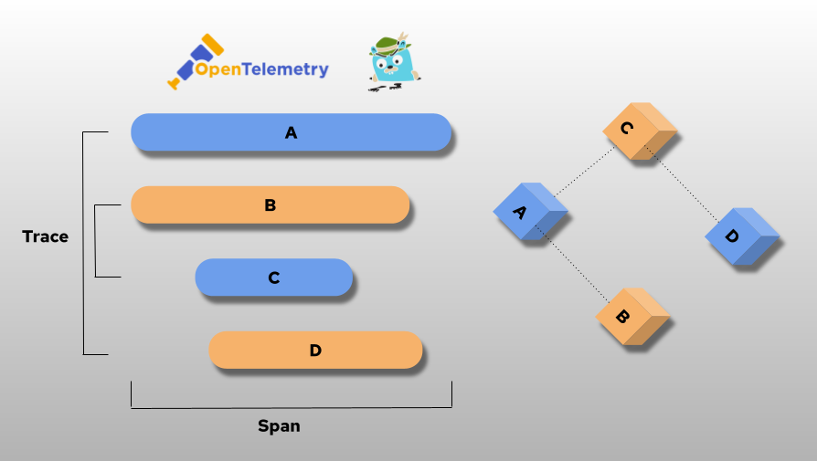
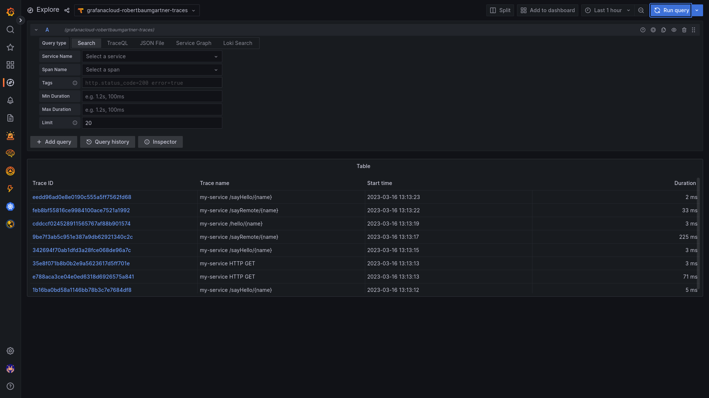
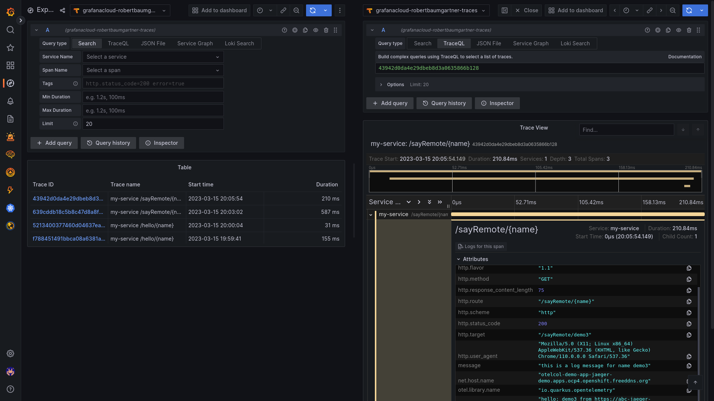

# Using OpenTelemetry and Grafana Tempo with Your Own Services/Application



*By Robert Baumgartner, Red Hat Austria, March 2023 (OpenShift 4.12, OpenShift distributed tracing data collection 0.63)*

In this blog I will guide you on

- How to use OpenTelemetry with a Quarkus application.

- How to forward your OpenTelememtry information to Tempo and display in Grafana UI.

In this blog I will use distributed tracing to instrument my services to gather insights into my service architecture. I am using distributed tracing for monitoring, network profiling, and troubleshooting the interaction between components in modern, cloud-native, microservices-based applications.

Using distributed tracing lets you perform the following functions:

- Monitor distributed transactions
- Optimize performance and latency
- Perform root cause analysis

I am using Red Hat OpenShift distributed tracing data collection - This component is based on the open source OpenTelemetry project.

This document is based on OpenShift 4.12. See [Distributed tracing release notes](https://docs.openshift.com/container-platform/4.12/distr_tracing/distributed-tracing-release-notes.html).

OpenShift distributed tracing data collection Operator based on OpenTelemetry 0.63.1

## OpenTelemetry and Grafana Tempo

**OpenTelemetry** is a collection of tools, APIs, and SDKs. Use it to instrument, generate, collect, and export telemetry data (metrics, logs, and traces) to help you analyze your software’s performance and behavior.

**Grafana Tempo** is an open source, easy-to-use and high-scale distributed tracing backend. Tempo is cost-efficient, requiring only object storage to operate, and is deeply integrated with Grafana, Prometheus, and Loki. (https://github.com/grafana/tempo)

In the the following diagram I will show you how the flow will be between your application, OpenTelemetry and Grafana Tempo.


To make the demo simpler I am using **Grafana Cloud**. Grafana Cloud is the open and composable observability platform that brings together metrics, logs, and traces with Grafana visualizations. Built for cloud native environments and powered by the best open source observability software – including Prometheus, Grafana Mimir, Grafana Loki, and Grafana Tempo – Grafana Cloud lets you focus on enabling observability, without the overhead of building, installing, maintaining, and scaling your observability stack.

More details can be found

- [OpenTelemetry Reference Architecture](https://opentelemetry.io/docs/)
- [Grafana Cloud](https://grafana.com/products/cloud/)

## Create Grafana Cloud User

For using the Grafana Cloud you can create a free user. This ** Free Forever Cloud** user is limited. But for test and demo purposes this is fine. Also I do not have any internal data so I can use the cloud.

[Registration](https://grafana.com/auth/sign-up/create-user?pg=prod-cloud)

After successful registration you need to go to the details of Tempo and store the URL, the user and generate an API Key.

```shell
$ export TEMPO_URL=tempo-prod-08-prod-eu-west-3.grafana.net:443
$ export TEMPO_USER=101234
$ export TEMPO_APIKEY=USghh4VZFSFxFsrDicgXK53q95KESubjRyXhzzQfGAoGUX3DZdXAuVZfAsU9T8shk=
```

## Enabling Distributed Tracing

A cluster administrator has to enable the Distributed Tracing Platform operator once. 

As of OpenShift 4.12, this is be done easily done by using the OperatorHub on the OpenShift console. See [Installing the Red Hat OpenShift distributed tracing platform Operator](https://docs.openshift.com/container-platform/4.12/distr_tracing/distr_tracing_install/distr-tracing-installing.html#distr-tracing-install-otel-operator_install-distributed-tracing).


In this demo we do need only the **OpenShift distributed tracing data collection Operator**.

Make sure you are logged in as cluster-admin.

After a short time, you can check that the operator pod is created and running and the CRD is created:

```shell
$ oc get pod -n openshift-operators|grep opentelemetry
opentelemetry-operator-controller-manager-69f7f56598-nsr5h   2/2     Running   0             10d
$ oc get crd opentelemetrycollectors.opentelemetry.io 
NAME                                       CREATED AT
opentelemetrycollectors.opentelemetry.io   2021-12-15T07:57:38Z
```

## Create a New Project

Create a new project (for example jaeger-demo) and give a normal user (such as developer) admin rights onto the project:

```shell
$ oc new-project tempo-demo
Now using project "jaeger-demo" on server "https://api.yourserver:6443".

You can add applications to this project with the 'new-app' command. For example, try:

    oc new-app rails-postgresql-example

to build a new example application in Ruby. Or use kubectl to deploy a simple Kubernetes application:

    kubectl create deployment hello-node --image=k8s.gcr.io/serve_hostname
$ oc policy add-role-to-user admin developer -n tempo-demo 
clusterrole.rbac.authorization.k8s.io/admin added: "developer"
```

## Login as the Normal User

```shell
$ oc login -u developer
Authentication required for https://api.yourserver:6443 (openshift)
Username: developer
Password: 
Login successful.

You have one project on this server: "tempo-demo"

Using project "tempo-demo".
```

## Create OpenTelemetry Collector

Create configmap and an OpenTelemetry Collector instance with the name my-otelcol.

```shell
$ export TEMPO_TOKEN=`echo -n "$TEMPO_USER:$TEMPO_APIKEY" | base64`
$ cat <<EOF |oc apply -f -
apiVersion: opentelemetry.io/v1alpha1
kind: OpenTelemetryCollector
metadata:
  name: my-otelcol-tempo
spec:
spec:
  config: |
    receivers:
      otlp:
        protocols:
          grpc:
          http:
    processors:
      batch:

    exporters:
      logging:
        loglevel: info

      otlp:
        endpoint: ${TEMPO_URL}
        headers:
          authorization: Basic ${TEMPO_TOKEN}
    service:
      pipelines:
        traces:
          receivers: [otlp]
          processors: [batch]
          exporters: [logging,otlp]
  mode: deployment
  resources: {}
  targetAllocator: {}
EOF
opentelemetrycollector.opentelemetry.io/my-otelcol-tempo created
```

When the OpenTelemetryCollector instance is up and running you can check log.

```shell
$ oc logs deployment/my-otelcol-tmpo-collector
2023-03-16T11:04:31.454Z    info    service/telemetry.go:110    Setting up own telemetry...
2023-03-16T11:04:31.454Z    info    service/telemetry.go:140    Serving Prometheus metrics    {"address": ":8888", "level": "basic"}
2023-03-16T11:04:31.454Z    info    components/components.go:30    In development component. May change in the future.    {"kind": "exporter", "data_type": "traces", "name": "logging", "stability": "in development"}
2023-03-16T11:04:31.454Z    warn    loggingexporter@v0.63.1/factory.go:110    'loglevel' option is deprecated in favor of 'verbosity'. Set 'verbosity' to equivalent value to preserve behavior.    {"kind": "exporter", "data_type": "traces", "name": "logging", "loglevel": "info", "equivalent verbosity level": "normal"}
2023-03-16T11:04:31.455Z    info    service/service.go:89    Starting otelcol...    {"Version": "0.63.1", "NumCPU": 4}
2023-03-16T11:04:31.455Z    info    extensions/extensions.go:42    Starting extensions...
2023-03-16T11:04:31.455Z    info    pipelines/pipelines.go:74    Starting exporters...
2023-03-16T11:04:31.455Z    info    pipelines/pipelines.go:78    Exporter is starting...    {"kind": "exporter", "data_type": "traces", "name": "logging"}
2023-03-16T11:04:31.455Z    info    pipelines/pipelines.go:82    Exporter started.    {"kind": "exporter", "data_type": "traces", "name": "logging"}
2023-03-16T11:04:31.455Z    info    pipelines/pipelines.go:78    Exporter is starting...    {"kind": "exporter", "data_type": "traces", "name": "otlp"}
2023-03-16T11:04:31.456Z    info    pipelines/pipelines.go:82    Exporter started.    {"kind": "exporter", "data_type": "traces", "name": "otlp"}
2023-03-16T11:04:31.456Z    info    pipelines/pipelines.go:86    Starting processors...
2023-03-16T11:04:31.456Z    info    pipelines/pipelines.go:90    Processor is starting...    {"kind": "processor", "name": "batch", "pipeline": "traces"}
2023-03-16T11:04:31.456Z    info    pipelines/pipelines.go:94    Processor started.    {"kind": "processor", "name": "batch", "pipeline": "traces"}
2023-03-16T11:04:31.456Z    info    pipelines/pipelines.go:98    Starting receivers...
2023-03-16T11:04:31.456Z    info    pipelines/pipelines.go:102    Receiver is starting...    {"kind": "receiver", "name": "otlp", "pipeline": "traces"}
2023-03-16T11:04:31.456Z    info    otlpreceiver/otlp.go:71    Starting GRPC server    {"kind": "receiver", "name": "otlp", "pipeline": "traces", "endpoint": "0.0.0.0:4317"}
2023-03-16T11:04:31.457Z    info    otlpreceiver/otlp.go:89    Starting HTTP server    {"kind": "receiver", "name": "otlp", "pipeline": "traces", "endpoint": "0.0.0.0:4318"}
2023-03-16T11:04:31.457Z    info    pipelines/pipelines.go:106    Receiver started.    {"kind": "receiver", "name": "otlp", "pipeline": "traces"}
2023-03-16T11:04:31.457Z    info    service/service.go:106    Everything is ready. Begin running and processing data.
```

You can update the collector by:

```shell
$ oc edit opentelemetrycollector my-otelcol-tempo
```

## Sample Application

### Deploy a Sample Application

All modern application development frameworks (like Quarkus) supports OpenTelemetry features, [Quarkus - USING OPENTELEMETRY](https://quarkus.io/guides/opentelemetry).

To simplify this document, I am using an existing example. The application is based on an example at [GitHub - rbaumgar/otelcol-demo-app: Quarkus demo app to show OpenTelemetry with Jaeger](https://github.com/rbaumgar/otelcol-demo-app). 

Deploying a sample application monitor-demo-app end expose a route:

```shell
$ cat <<EOF |oc apply -f -
apiVersion: apps/v1
kind: Deployment
metadata:
  labels:
    app: otelcol-demo-app
    app.kubernetes.io/name: otelcol-demo-app
    app.kubernetes.io/version: 1.0.0-SNAPSHOT
    app.openshift.io/runtime: quarkus
  name: otelcol-demo-app
spec:
  replicas: 1
  selector:
    matchLabels:
      app: otelcol-demo-app
  template:
    metadata:
      labels:
        app: otelcol-demo-app
        app.openshift.io/runtime: quarkus
        app.kubernetes.io/name: otelcol-demo-app
        app.kubernetes.io/version: 1.0.0-SNAPSHOT        
    spec:
      containers:
      - image: quay.io/rbaumgar/otelcol-demo-app-jvm
        imagePullPolicy: Always
        name: otelcol-demo-app
---
apiVersion: v1
kind: Service
metadata:
  labels:
    app: otelcol-demo-app
    app.kubernetes.io/name: otelcol-demo-app
    app.kubernetes.io/version: 1.0.0-SNAPSHOT
    app.openshift.io/runtime: quarkus    
  name: otelcol-demo-app
spec:
  ports:
  - port: 8080
    protocol: TCP
    targetPort: 8080
    name: web
  selector:
    app: otelcol-demo-app
  type: ClusterIP
---
apiVersion: route.openshift.io/v1
kind: Route
metadata:
  labels:
    app: otelcol-demo-app
    app.kubernetes.io/name: otelcol-demo-app
    app.kubernetes.io/version: 1.0.0-SNAPSHOT
    app.openshift.io/runtime: quarkus       
  name: otelcol-demo-app
spec:
  path: /
  to:
    kind: Service
    name: otelcol-demo-app
  port:
    targetPort: web
  tls:
    termination: edge    
EOF
deployment.apps/otelcol-demo-app created
service/otelcol-demo-app created
route.route.openshift.io/otelcol-demo-app exposed
$ oc set env deployment/otelcol-demo-app OTELCOL_SERVER=http://`oc get route otelcol-demo-app -o jsonpath='{.spec.host}'`
```

You need to add an environment variable with the name OTELCOL_SERVER to specify a different url for the OpenTelemetry Collector.

### Test Sample Application

Check the router url with */hello* and see the hello message with the pod name. Do this multiple times.

```shell
$ export URL=https://$(oc get route otelcol-demo-app -o jsonpath='{.spec.host}')
$ curl $URL/hello
hello 
$ curl $URL/sayHello/demo1
hello: demo1
$ curl $URL/sayRemote/demo2
hello: demo2 from http://otelcol-demo-app-jaeger-demo.apps.rbaumgar.demo.net/
...
```

Go to Grafana Cloud URL.
Launch Grafana.
Click on Explore. 
Select as Query type Search and Run Query.
Find Traces...



You can select some details on the query. e.g.

- Service Name: you can select the the service name which specified in the application.properties (quarkus.application.name) of the demo app.
- Tags: you can select the name of the trace. E.g. name="/sayRemote/{name}" in my demo application.
- Min/Max Duration: select only traces which takes very log, e.g. min = 500ms

Open one trace entry and expand it to get all the details.



Done!

If you want more details on how the OpenTelemetry is done in Quarkus go to the Github example at [GitHub - rbaumgar/otelcol-demo-app: Quarkus demo app to show OpenTelemetry](https://github.com/rbaumgar/otelcol-demo-app). 

## Remove this Demo

```shell
$ oc delete deployment,svc,route otelcol-demo-app
$ oc delete opentelemetrycollectors my-otelcol-tempo
$ oc delete project jaeger-demo
```

This document: 

**[Github: rbaumgar/otelcol-demo-app](https://github.com/rbaumgar/otelcol-demo-app/blob/master/OpenTelemetry_with_Tempo.md)**