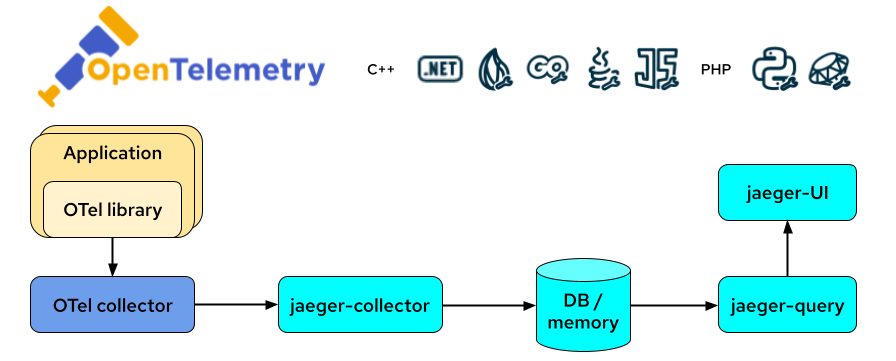

# Service Performance Monitoring (SPM)

# Using OpenTelemetry and Jaeger with Your Own Services/Application


*By Robert Baumgartner, Red Hat Austria, February 2023 (OpenShift 4.12)*

In this blog I will guide you on

- How to use OpenTelemetry with a Quarkus application.

- How to display your OpenTeleemtry information on Jaeger UI.

In this blog I will use distributed tracing to instrument my services to gather insights into my service architecture. I am using distributed tracing for monitoring, network profiling, and troubleshooting the interaction between components in modern, cloud-native, microservices-based applications.

Using distributed tracing lets you perform the following functions:

- Monitor distributed transactions
- Optimize performance and latency
- Perform root cause analysis

Red Hat OpenShift distributed tracing consists of two components:

Red Hat OpenShift distributed tracing platform - This component is based on the open source Jaeger project.
Red Hat OpenShift distributed tracing data collection - This component is based on the open source OpenTelemetry project.

This document is based on OpenShift 4.12. See [Distributed tracing release notes](https://docs.openshift.com/container-platform/4.12/distr_tracing/distributed-tracing-release-notes.html).

OpenShift distributed tracing platform Operator is based on Jaeger 1.39.

OpenShift distributed tracing data collection Operator based on OpenTelemetry 0.63.1

## OpenTelemetry and Jaeger

**OpenTelemetry** is a collection of tools, APIs, and SDKs. Use it to instrument, generate, collect, and export telemetry data (metrics, logs, and traces) to help you analyze your software’s performance and behavior.

**Jaeger** is a tool to monitor and troubleshoot transactions in complex distributed systems.

In the the following diagram I will show you how the flow will be between your application, OpenTelemetry and Jaeger.



To make the demo simpler I am using the AllInOne  image from Jaeger. This will install collector, query and Jaeger UI in a single pod, using in-memory storage by default.

More details can be found
- [OpenTelemetry Reference Architecture](https://opentelemetry.io/docs/)
- [Jaeger Components](https://www.jaegertracing.io/docs/1.29/architecture/#components)

## Enabling Distributed Tracing

A cluster administrator has to enable the Distributed Tracing Platform and Distributed Tracing Data Collection operator once. 

As of OpenShift 4.12, this is be done easily done by using the OperatorHub on the OpenShift console. See [Installing the Red Hat OpenShift distributed tracing platform Operator](https://docs.openshift.com/container-platform/4.12/distr_tracing/distr_tracing_install/distr-tracing-installing.html#distr-tracing-jaeger-operator-install_install-distributed-tracing).


In this demo we do not install the OpenShift Elasticsearch Operator, because we use only in-memory tracing - no perstistence.

Make sure you are logged in as cluster-admin:


After a short time, you can check that the operator pods were created and running and the CRDs are created:

```shell
$ oc get pod -n openshift-distributed-tracing|grep jaeger
jaeger-operator-bc65549bd-hch9v                              1/1     Running   0             10d
$ oc get pod -n openshift-operators|grep opentelemetry
opentelemetry-operator-controller-manager-69f7f56598-nsr5h   2/2     Running   0             10d
$ oc get crd jaegers.jaegertracing.io 
NAME                       CREATED AT
jaegers.jaegertracing.io   2021-12-08T15:51:29Z
$ oc get crd opentelemetrycollectors.opentelemetry.io 
NAME                                       CREATED AT
opentelemetrycollectors.opentelemetry.io   2021-12-15T07:57:38Z
```

## Enabling Monitoring of Your Own Services in OpenShift 4.6+

Using the montoring for user-defined projects in OpenShift saves us to deploy our own Prometheus instance.

In OpenShift version 4.6+ monitoring for user-defined projects is GA. See [Enabling monitoring for user-defined projects](https://docs.openshift.com/container-platform/4.12/monitoring/enabling-monitoring-for-user-defined-projects.html)

As of OpenShift 4.6+, this is done by an update on the configmap within the project openshift-monitoring.

Make sure you are logged in as cluster-admin:

```shell
$ cat <<EOF | oc apply -f -
apiVersion: v1
kind: ConfigMap
metadata:
  name: cluster-monitoring-config
  namespace: openshift-monitoring
data:
  config.yaml: |
    enableUserWorkload: true
    thanosQuerier:
      enableRequestLogging: true    
EOF
```

## Check User Workload Monitoring

After a short time, you can check that the prometheus-user-workload pods were created and running:

```shell
$ oc get pod -n openshift-user-workload-monitoring 
NAME                                   READY   STATUS    RESTARTS   AGE
prometheus-operator-7bcc9cc899-p8cbr   1/1     Running   0          10h
prometheus-user-workload-0             5/5     Running   1          10h
prometheus-user-workload-1             5/5     Running   1          10h
thanos-ruler-user-workload-0           3/3     Running   0          10h
thanos-ruler-user-workload-1           3/3     Running   0          10h
```

## Create a New Project

Create a new project (for example jaeger-demo) and give a normal user (such as developer) admin rights onto the project. Add the role user-workload-monitoring-config-edit to the user:

```shell
$ oc new-project jaeger-demo
Now using project "jaeger-demo" on server "https://api.yourserver:6443".

You can add applications to this project with the 'new-app' command. For example, try:

    oc new-app rails-postgresql-example

to build a new example application in Ruby. Or use kubectl to deploy a simple Kubernetes application:

    kubectl create deployment hello-node --image=k8s.gcr.io/serve_hostname
$ oc policy add-role-to-user admin developer -n jaeger-demo 
clusterrole.rbac.authorization.k8s.io/admin added: "developer"
$ oc -n openshift-user-workload-monitoring adm policy add-role-to-user \
    user-workload-monitoring-config-edit developer \
    --role-namespace openshift-user-workload-monitoring
$ SECRET=`oc get secret -n openshift-user-workload-monitoring | grep  prometheus-user-workload-token | head -n 1 | awk '{print $1 }'`    
```

The secret is required later.

## Login as the Normal User

```shell
$ oc login -u developer
Authentication required for https://api.yourserver:6443 (openshift)
Username: developer
Password: 
Login successful.

You have one project on this server: "jaeger-demo"

Using project "jaeger-demo".
```

## Create Jaeger

Create a simple Jaeger instance with the name my-jager
```shell
$ cat <<EOF |oc apply -f -
apiVersion: jaegertracing.io/v1
kind: Jaeger
metadata:
  name: my-jaeger
spec: 
  allInOne:
    config: {}
    metricsStorage: {}
    options: {}
    resources: {}
  strategy: allinone
EOF
jaeger.jaegertracing.io/my-jaeger created
```

When the Jaeger instance is up and running you can check the service and route.

```
$ oc get svc
NAME                           TYPE        CLUSTER-IP       EXTERNAL-IP   PORT(S)                                  AGE
my-jaeger-agent                ClusterIP   None             <none>        5775/UDP,5778/TCP,6831/UDP,6832/UDP                        3s
my-jaeger-collector            ClusterIP   172.30.112.217   <none>        9411/TCP,14250/TCP,14267/TCP,14268/TCP,4317/TCP,4318/TCP   3s
my-jaeger-collector-headless   ClusterIP   None             <none>        9411/TCP,14250/TCP,14267/TCP,14268/TCP,4317/TCP,4318/TCP   3s
my-jaeger-query                ClusterIP   172.30.33.207    <none>        443/TCP,16685/TCP                                          3s
$ oc get route my-jaeger -o jsonpath='{.spec.host}'
my-jaeger-jaeger-demo.apps.rbaumgar.demo.net
```

Open a new browser window and go to the route url and login with your OpenShift login (developer).


## Create OpenTelemetry Collector

Create configmap and an OpenTelemetry Collector instance with the name my-otelcol.

The configmap is used because the Jaeger service requires encryption. These certificates are issued as TLS web server certificates. More details can be found at [Understanding service serving certificates](https://docs.openshift.com/container-platform/4.9/security/certificates/service-serving-certificate.html)

```shell
$ cat <<EOF |oc apply -f -
apiVersion: opentelemetry.io/v1alpha1
kind: OpenTelemetryCollector
metadata:
  name: my-otelcol
spec:
  config: |
    receivers:
      jaeger:
        protocols:
          thrift_http:
            endpoint: "0.0.0.0:14278"

      otlp:
        protocols:
          grpc:
          http:

      # Dummy receiver that's never used, because a pipeline is required to have one.
      otlp/spanmetrics:
        protocols:
          grpc:
            endpoint: "localhost:65535"

    exporters:
      prometheus:
        endpoint: "0.0.0.0:8889"

      jaeger:
        endpoint: my-jaeger-collector-headless.jaeger-demo.svc:14250
        tls:
          ca_file: "/var/run/secrets/kubernetes.io/serviceaccount/service-ca.crt"

    processors:
      batch:
      spanmetrics:
        metrics_exporter: prometheus

    service:
      pipelines:
        traces:
          receivers: [otlp, jaeger]
          processors: [spanmetrics, batch]
          exporters: [jaeger]
        # The exporter name in this pipeline must match the spanmetrics.metrics_exporter name.
        # The receiver is just a dummy and never used; added to pass validation requiring at least one receiver in a pipeline.
        metrics/spanmetrics:
          receivers: [otlp/spanmetrics]
          exporters: [prometheus]

  mode: deployment
  ports:
    - name: metrics
      port: 8889
      protocol: TCP
      targetPort: 8889
  ingress: {}
  image: 'otel/opentelemetry-collector-contrib:latest'
EOF
opentelemetrycollector.opentelemetry.io/my-otelcol created
```

When the OpenTelemetryCollector instance is up and running you can check log.

```shell
$ oc logs deployment/my-otelcol-collector
2023-02-01T06:50:31.740Z        info    service/telemetry.go:110        Setting up own telemetry...
2023-02-01T06:50:31.740Z        info    service/telemetry.go:140        Serving Prometheus metrics      {"address": ":8888", "level": "basic"}
2023-02-01T06:50:31.741Z        info    service/service.go:89   Starting otelcol...     {"Version": "0.63.1", "NumCPU": 4}
2023-02-01T06:50:31.741Z        info    extensions/extensions.go:42     Starting extensions...
2023-02-01T06:50:31.741Z        info    pipelines/pipelines.go:74       Starting exporters...
2023-02-01T06:50:31.741Z        info    pipelines/pipelines.go:78       Exporter is starting... {"kind": "exporter", "data_type": "traces", "name": "jaeger"}
2023-02-01T06:50:31.743Z        info    jaegerexporter@v0.63.0/exporter.go:185  State of the connection with the Jaeger Collector backend     {"kind": "exporter", "data_type": "traces", "name": "jaeger", "state": "IDLE"}
2023-02-01T06:50:31.743Z        info    pipelines/pipelines.go:82       Exporter started.       {"kind": "exporter", "data_type": "traces", "name": "jaeger"}
2023-02-01T06:50:31.743Z        info    pipelines/pipelines.go:86       Starting processors...
2023-02-01T06:50:31.743Z        info    pipelines/pipelines.go:98       Starting receivers...
2023-02-01T06:50:31.743Z        info    pipelines/pipelines.go:102      Receiver is starting... {"kind": "receiver", "name": "otlp", "pipeline": "traces"}
2023-02-01T06:50:31.743Z        info    otlpreceiver/otlp.go:71 Starting GRPC server    {"kind": "receiver", "name": "otlp", "pipeline": "traces", "endpoint": "0.0.0.0:4317"}
2023-02-01T06:50:31.743Z        info    otlpreceiver/otlp.go:89 Starting HTTP server    {"kind": "receiver", "name": "otlp", "pipeline": "traces", "endpoint": "0.0.0.0:4318"}
2023-02-01T06:50:31.743Z        info    pipelines/pipelines.go:106      Receiver started.       {"kind": "receiver", "name": "otlp", "pipeline": "traces"}
2023-02-01T06:50:31.743Z        info    service/service.go:106  Everything is ready. Begin running and processing data.
2023-02-01T06:50:32.743Z        info    jaegerexporter@v0.63.0/exporter.go:185  State of the connection with the Jaeger Collector backend     {"kind": "exporter", "data_type": "traces", "name": "jaeger", "state": "READY"}
```

Very important is the second line ("Serving Prometheus metrics") which shows that Promethes is available at port 8888. In this example it can be access at "curl my-otelcol-collector-monitoring:8888/metrics" from within the collector pod.

Very important is the last line ("State of connection...") which shows that the collector is connected to the Jaeger instance.
If this is not the case, you have to update the spec.config.exports.jaeger.endpoint value in your OpenTelemetry Collector instance. Should be <jager-collector-headless>.<jaeger-namespace>.svc:14250.

Can be done by:

```shell
$ oc edit opentelemetrycollector my-otelcol
```

## Setting up Metrics Collection

To use the metrics exposed by OpenTelemetry Collector, you need to configure OpenShift Monitoring to scrape metrics from the */metrics* endpoint. You can do this using a ServiceMonitor, a custom resource definition (CRD) that specifies how a service should be monitored, or a PodMonitor, a CRD that specifies how a pod should be monitored. The former requires a Service object, while the latter does not, allowing Prometheus to directly scrape metrics from the metrics endpoint exposed by a pod.

```shell
$ cat <<EOF | oc apply -f -
apiVersion: monitoring.coreos.com/v1
kind: ServiceMonitor
metadata:
  labels:
    k8s-app: otelcol-monitor
  name: otelcol-monitor
spec:
  endpoints:
    - interval: 30s
      path: /metrics
      port: metrics
      scheme: http
  selector:
    matchLabels:
      app.kubernetes.io/name: my-otelcol-collector
EOF
servicemonitor.monitoring.coreos.com/otelcol-monitor created
$ oc get servicemonitor
NAME                   AGE
otelcol-monitor   42s
```

:star: The *matchLabels* must be the same as it is defined at monitoring service of The OpenTelemetry Collector!

## Accessing the Metrics of Your Service

Once you have enabled monitoring your own services, deployed a service, and set up metrics collection for it, you can access the metrics of the service as a cluster administrator, as a developer, or as a user with view permissions for the project.

To access the metrics as a developer or a user with permissions, go to the OpenShift Container Platform web console, switch to the Developer Perspective, then click **Observer → Metrics**.
     
     :star: Developers can only use the Developer Perspective. They can only query metrics from a single project.

Use the "Custom query" (PromQL) interface to run queries for your services.
Enter "otelcol" and ENTER you will get a list of all available values...

Two metric names will be created:

calls_total
Type: counter
Description: counts the total number of spans, including error spans. Call counts are differentiated from errors via the status_code label. Errors are identified as any time series with the label status_code = "STATUS_CODE_ERROR".
latency
Type: histogram
Description: a histogram of span latencies. Under the hood, Prometheus histograms will create a number of time series:
latency_count: The total number of data points across all buckets in the histogram.
latency_sum: The sum of all data point values.
latency_bucket: A collection of n time series (where n is the number of latency buckets) for each latency bucket identified by an le (less than or equal to) label. The latency_bucket counter with lowest le and le >= span latency will be incremented for each span.
The following formula aims to provide some guidance on the number of new time series created:

Copy
num_status_codes * num_span_kinds * (1 + num_latency_buckets) * num_operations

Where:
  num_status_codes = 3 max (typically 2: ok/error)
  num_span_kinds = 6 max (typically 2: client/server)
  num_latency_buckets = 17 default
Plugging those numbers in, assuming default configuration:

Copy
max = 324 * num_operations
typical = 72 * num_operations

You can also use the **Thanos Querier** to display the application metrics. The Thanos Querier enables aggregating and, optionally, deduplicating cluster and user workload metrics under a single, multi-tenant interface.

Thanos Querier can be reached at: https://thanos-querier-openshift-monitoring.apps.your.cluster/graph

If you are just interested in exposing application metrics to the dashboard, you can stop here.


## Sample Application

### Deploy a Sample Application

All modern application development frameworks (like Quarkus) supports OpenTelemetry features, [Quarkus - USING OPENTELEMETRY](https://quarkus.io/guides/opentelemetry).

To simplify this document, I am using an existing example. The application is based on an example at [GitHub - rbaumgar/otelcol-demo-app: Quarkus demo app to show OpenTelemetry with Jaeger](https://github.com/rbaumgar/otelcol-demo-app). 

Deploying a sample application monitor-demo-app end expose a route:

```shell
$ cat <<EOF |oc apply -f -
apiVersion: apps/v1
kind: Deployment
metadata:
  labels:
    app: otelcol-demo-app
  name: otelcol-demo-app
spec:
  replicas: 1
  selector:
    matchLabels:
      app: otelcol-demo-app
  template:
    metadata:
      labels:
        app: otelcol-demo-app
    spec:
      containers:
        - name: otelcol-demo-app
          image: quay.io/rbaumgar/otelcol-demo-app-jvm
          env:
            - name: OTELCOL_SERVER
              value: 'http://my-otelcol-collector:4317'              
---
apiVersion: v1
kind: Service
metadata:
  labels:
    app: otelcol-demo-app
  name: otelcol-demo-app
spec:
  ports:
  - port: 8080
    protocol: TCP
    targetPort: 8080
    name: web
  selector:
    app: otelcol-demo-app
  type: ClusterIP
---
apiVersion: route.openshift.io/v1
kind: Route
metadata:
  labels:
    app: otelcol-demo-app
  name: otelcol-demo-app
spec:
  path: /
  to:
    kind: Service
    name: otelcol-demo-app
  port:
    targetPort: web
  tls:
    termination: edge    
EOF
deployment.apps/otelcol-demo-app created
service/otelcol-demo-app created
route.route.openshift.io/otelcol-demo-app exposed
```

You can add an environment variable with the name OTELCOL_SERVER if you need to specify a different url for the OpenTelemetry Collector. Default: http://my-otelcol-collector:4317 

### Test Sample Application

Check the router url with */hello* and see the hello message with the pod name. Do this multiple times.

```shell
$ export URL=$(oc get route otelcol-demo-app -o jsonpath='{.spec.host}')
$ curl $URL/hello
hello 
$ curl $URL/sayHello/demo1
hello: demo1
$ curl $URL/sayRemote/demo2
hello: demo2 from http://otelcol-demo-app-jaeger-demo.apps.rbaumgar.demo.net/
...
```

Go to Jager URL.
Reload by pressing F5.
Under Service select my-service. 
Find Traces...


*star* The service name is specified in the application.properties (quarkus.application.name) of the demo app.
*star* The url of the collector is specified in the application.properties (quarkus.opentelemetry.tracer.exporter.otlp.endpoint=http://my-otelcol-collector:4317).

Open one trace entry and expand it to get all the details.


Done!

If you want more details on how the OpenTracing is done in Quarkus go to the Github example at [GitHub - rbaumgar/otelcol-demo-app: Quarkus demo app to show OpenTelemetry with Jaeger](https://github.com/rbaumgar/otelcol-demo-app). 

## Remove this Demo

```shell
$ oc delete deployment,svc,route otelcol-demo-app
$ oc delete opentelemetrycollector my-otelcol
$ oc delete jaeger my-jaeger
$ oc delete cm my-otelcol-cabundle
$ oc delete project jaeger-demo
```

This document: 

**[Github: rbaumgar/otelcol-demo-app](https://github.com/rbaumgar/otelcol-demo-app/blob/master/ServicePerformanceMonitoring.md)**