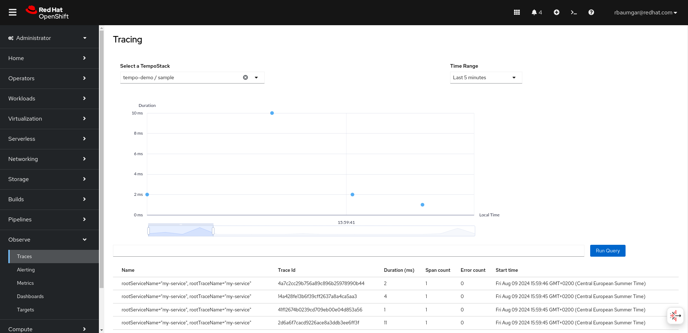

## Required Operator

## Create Red Hat build of OpenTelemetry Operator

???

## Create Cluster Observability Oprator

???

## Plugin

```shell
$ oc apply -f - << EOF
apiVersion: observability.openshift.io/v1alpha1
kind: UIPlugin
metadata:
  name: distributed-tracing
spec:
  type: DistributedTracing
EOF
```

## Create Tempo Operator

Create a project for the Tempo Operator by running the following command:

```shell
$ oc apply -f - << EOF
apiVersion: project.openshift.io/v1
kind: Project
metadata:
  labels:
    kubernetes.io/metadata.name: openshift-tempo-operator
    openshift.io/cluster-monitoring: "true"
  name: openshift-tempo-operator
EOF
```

Create an Operator group by running the following command:

```shell
$ oc apply -f - << EOF
apiVersion: operators.coreos.com/v1
kind: OperatorGroup
metadata:
  name: openshift-tempo-operator
  namespace: openshift-tempo-operator
spec:
  upgradeStrategy: Default
EOF
```

Create a subscription by running the following command:

```shell
$ oc apply -f - << EOF
apiVersion: operators.coreos.com/v1alpha1
kind: Subscription
metadata:
  name: tempo-product
  namespace: openshift-tempo-operator
spec:
  channel: stable
  installPlanApproval: Automatic
  name: tempo-product
  source: redhat-operators
  sourceNamespace: openshift-marketplace
  startingCSV: tempo-operator.v0.10.0-8  
EOF
```


## ??? user-workload monitoring stack

## create project

```shell
oc new-project tempo-demo
```

## Create Minio secret

```shell
apiVersion: v1
kind: Secret
metadata:
  name: minio-test
stringData:
  endpoint: http://minio.minio.svc:9000
  bucket: tempo-demo
  access_key_id: tempo
  access_key_secret: <secret>
type: Opaque
EOF
```

endpoint: <service>.<namespace>.svc:9000

Networkpolicy

```shell
apiVersion: networking.k8s.io/v1
kind: NetworkPolicy
metadata:
  name: allow-from-tempo-demo
  namespace: minio
spec:
  podSelector:
    matchLabels:
      app.kubernetes.io/name: minio
  ingress:
  - from:
    - namespaceSelector:
        matchLabels:
          kubernetes.io/metadata.name: tempo-demo
      ports:
        - port: 9000
EOF                  
```

## Create TempoStack

```shell
apiVersion: tempo.grafana.com/v1alpha1
kind: TempoStack
metadata:
  name: sample
  namespace: <project_of_tempostack_instance>
spec:
  storageSize: 1Gi
  storage:
    secret:
      name: minio-test 
      type: s3 
  template:
    queryFrontend:
      jaegerQuery:
        enabled: true
        ingress:
          route:
            termination: edge
          type: route
        monitorTab:
          enabled: true 
          prometheusEndpoint: https://thanos-querier.openshift-monitoring.svc.cluster.local:9091           
```           


ab 4.9.24 option to template.queryFrontend.jaegerQuery.authentication.enabled
https://github.com/grafana/tempo-operator/pull/910/files

storage/secret:
name: The value of the name in the metadata of the secret.
type: The accepted values are `azure` for Azure Blob Storage; `gcs` for Google Cloud Storage; and `s3` for Amazon S3, MinIO, or Red Hat OpenShift Data Foundation.   

The TempoStack custom resource must specify the following: the Monitor tab is enabled, and the Prometheus endpoint is set to the Thanos querier service to query the data from the user-defined monitoring stack.

Enables the monitoring tab in the Jaeger console.
The service name for Thanos Querier from user-workload monitoring.


## Check running pods

```shell
$ oc get pod
NAME                                           READY   STATUS    RESTARTS      AGE
tempo-sample-compactor-5d65789459-p5jl5        1/1     Running   0             8m36s
tempo-sample-distributor-6c7cdff4f5-kx8ph      1/1     Running   0             25m
tempo-sample-ingester-0                        1/1     Running   0             8m14s
tempo-sample-querier-5888bf5cd4-68pnd          1/1     Running   8 (13m ago)   25m
tempo-sample-query-frontend-84df5d7548-rr4b4   2/2     Running   8 (13m ago)   25m

$ oc get tempostacks.tempo.grafana.com -o json sample|jq .status.components
{
  "compactor": {
    "Running": [
      "tempo-sample-compactor-78ff858884-ct8lv"
    ]
  },
  "distributor": {
    "Running": [
      "tempo-sample-distributor-596cbdd6fb-7hxl5"
    ]
  },
  "gateway": {},
  "ingester": {
    "Running": [
      "tempo-sample-ingester-0"
    ]
  },
  "querier": {
    "Running": [
      "tempo-sample-querier-89dc8c5cf-46dwz"
    ]
  },
  "queryFrontend": {
    "Running": [
      "tempo-sample-query-frontend-8689cd755c-fbcfh"
    ]
  }
}
```

## Spanmetrics


```shell
$ cat <<EOF |oc apply -f -
kind: OpenTelemetryCollector
apiVersion: opentelemetry.io/v1beta1
metadata:
  name: otel
spec:
  mode: deployment
  observability:
    metrics:
      enableMetrics: true 
  config: 
    connectors:
      spanmetrics: 
        metrics_flush_interval: 15s

    exporters:
      otlp:
        endpoint: "tempo-sample-distributor:4317"
        tls:
          insecure: true

      prometheus: 
        endpoint: 0.0.0.0:8889
        add_metric_suffixes: false
        resource_to_telemetry_conversion:
          enabled: true # by default resource attributes are dropped

    receivers:
      otlp: 
        protocols:
          grpc: {}
          http: {}

    service:
      pipelines:
        metrics:
          exporters: 
            - prometheus
          processors: []
          receivers: 
            - spanmetrics

        traces:
          exporters: 
            - otlp
            - spanmetrics
          processors: []
          receivers: 
            - otlp
EOF
```

Creates the ServiceMonitor custom resource to enable scraping of the Prometheus exporter.
The Spanmetrics connector receives traces and exports metrics.
The OTLP receiver to receive spans in the OpenTelemetry protocol.
The Prometheus exporter is used to export metrics in the Prometheus format.
The Spanmetrics connector is configured as exporter in traces pipeline.
The Spanmetrics connector is configured as receiver in metrics pipeline.  

```shell
$ oc get pod -l app.kubernetes.io/name=otel-collector
NAME                              READY   STATUS    RESTARTS   AGE
otel-collector-586d4cf7c8-5kljc   1/1     Running   0          89s

$ oc get opentelemetrycollectors.opentelemetry.io otel -o json|jq .status
{
  "image": "registry.redhat.io/rhosdt/opentelemetry-collector-rhel8@sha256:4050a35b37943c9ccfa835edecaffbe7d1e31ab48e2f491b2e63ac820f8fe15e",
  "scale": {
    "replicas": 1,
    "selector": "app.kubernetes.io/component=opentelemetry-collector,app.kubernetes.io/instance=tempo-demo.otel,app.kubernetes.io/managed-by=opentelemetry-operator,app.kubernetes.io/name=otel-collector,app.kubernetes.io/part-of=opentelemetry,app.kubernetes.io/version=latest",
    "statusReplicas": "1/1"
  },
  "version": "0.102.1"
}
```

## Create demo app

```shell
$ oc set env deployment/otelcol-demo-app \
     OTELCOL_SERVER=http://otel-collector:4317 \
     SERVICE_NAME=https://`oc get route otelcol-demo-app -o jsonpath='{.spec.host}'`

```
## Generate Workload

```shell
export URL=https://$(oc get route otelcol-demo-app -o jsonpath='{.spec.host}')

for i in {1..30000}; do curl $URL/prime/${RANDOM} >/dev/null 2>&1; sleep .10; done

for i in {1..30000}; do curl $URL/hello >/dev/null 2>&1; sleep .10; done
```

## Metrics

## SPM

## Trace

( remove networkpolicies)

```shell
apiVersion: networking.k8s.io/v1
kind: NetworkPolicy
metadata:
  name: allow-from-UIPlugin
  namespace: tempo-demo
spec:
  podSelector:
    matchLabels:
      app.kubernetes.io/name: minio
  ingress:
  - from:
    - namespaceSelector:
        matchLabels:
          kubernetes.io/metadata.name: openshift-operators
      podSelector:
        matchLabels:
          app.kubernetes.io/part-of: UIPlugin     
      ports:
        - port: 9000          
```

Go to Observe - Traces

Users can select different TempoStacks by using the dropdown at the top.

The first visualization capability we are delivering this time is a scatter plot (or bubble chart). In this kind of representation, spans are represented as solid points (or bubbles) in which:

- The bubble size represents the size of the span.
- Colour represents status: blue means successful span, and red means that there is an error.
- The X-axis represents the timeline of when the spans were generated.
- Position in the Y-axis represents the duration of the spans.

All in all, current visualization features include the duration of traces over time, and a table including all key information you need, such as Trace ID, duration, Span count, Error count, and Start time. 



## Troubleshooting Dashboard

## Alerts

Span RED metrics and alerting rules
The metrics generated by the spanmetrics connector are usable with alerting rules. For example, for alerts about a slow service or to define service level objectives (SLOs), the connector creates a duration_bucket histogram and the calls counter metric. These metrics have labels that identify the service, API name, operation type, and other attributes.

```shell
apiVersion: monitoring.coreos.com/v1
kind: PrometheusRule
metadata:
  name: span-red
spec:
  groups:
  - name: server-side-latency
    rules:
    - alert: SpanREDFrontendAPIRequestLatency
      expr: histogram_quantile(0.95, sum(rate(duration_bucket{service_name="frontend", span_kind="SPAN_KIND_SERVER"}[5m])) by (le, service_name, span_name)) > 2000 
      labels:
        severity: Warning
      annotations:
        summary: "High request latency on {{$labels.service_name}} and {{$labels.span_name}}"
        description: "{{$labels.instance}} has 95th request latency above 2s (current value: {{$value}}s)"
```

The expression for checking if 95% of the front-end server response time values are below 2000 ms. The time range ([5m]) must be at least four times the scrape interval and long enough to accommodate a change in the metric.        

## OpenTelemetry Autoinstrumentation

oc port-forward deploy/otel-collector 4318:4318

wget https://github.com/open-telemetry/opentelemetry-java-instrumentation/releases/latest/download/opentelemetry-javaagent.jar
export JAVA_TOOL_OPTIONS=-javaagent:./opentelemetry-javaagent.jar
export OTEL_SERVICE_NAME=your-service-name
export OTEL_EXPORTER_OTLP_ENDPOINT=http://localhost:4318/
export OTEL_JAVAAGENT_LOGGING=none

mvn quarkus:dev


## Useful Links

https://developers.redhat.com/articles/2024/07/10/introducing-new-traces-ui-red-hat-openshift-web-console

https://developers.redhat.com/articles/2024/07/10/improved-observability-signal-correlation-red-hat-openshift
